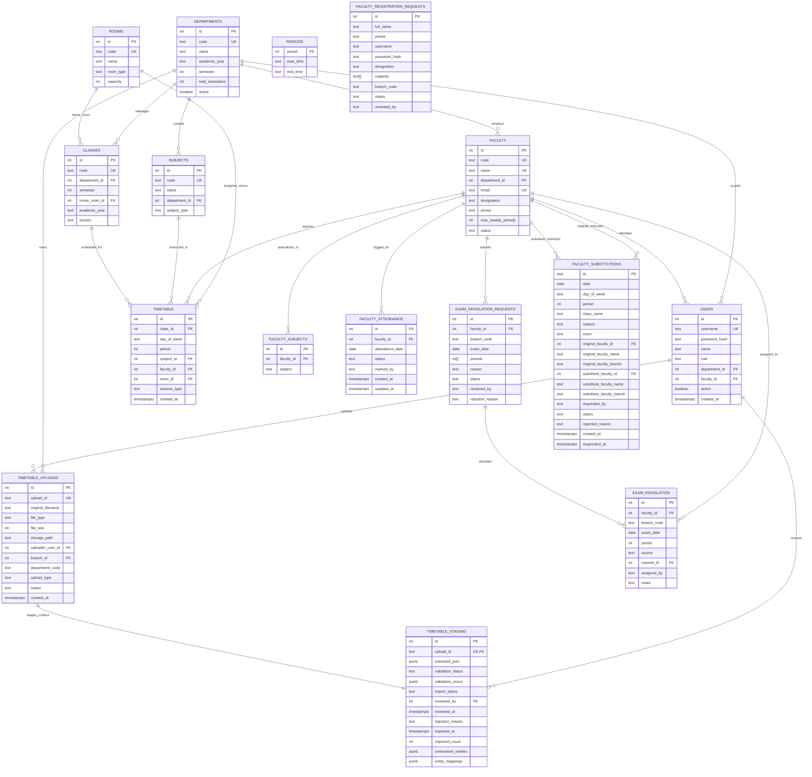
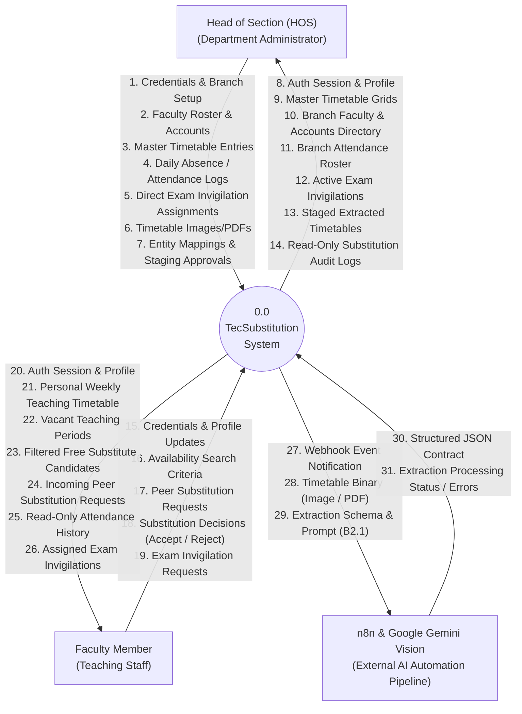
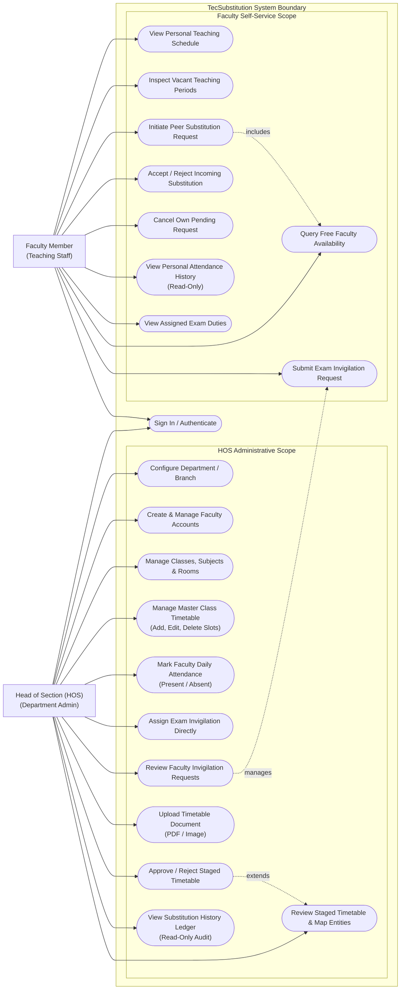
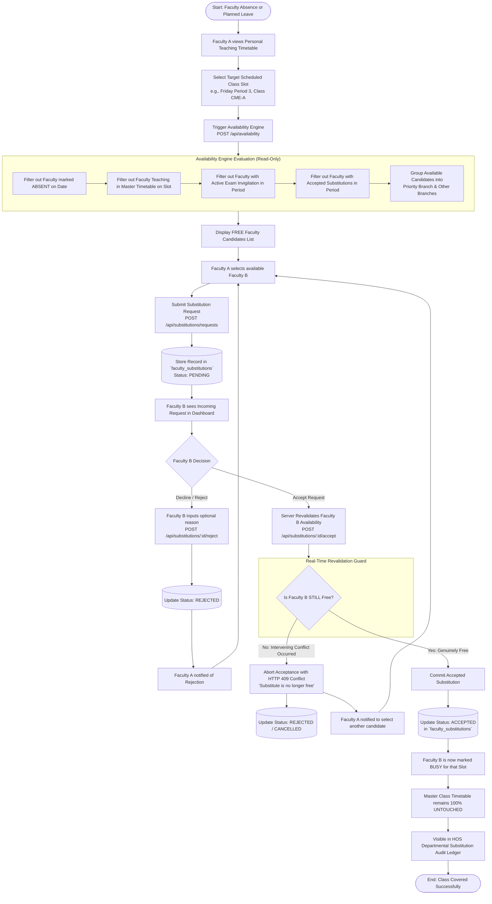
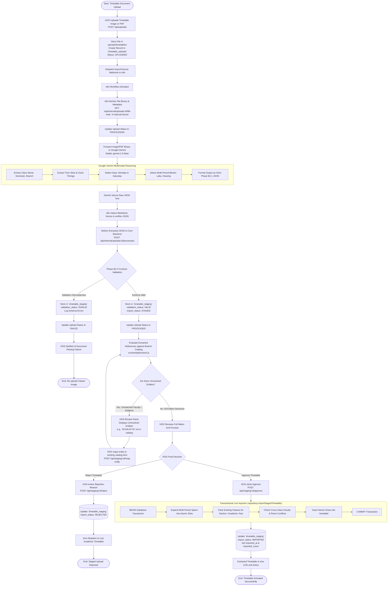

# TecSubstitution: Centralized Faculty Timetable & Substitution Management System

---

## 1. TITLE PAGE

**PROJECT TITLE:**  
**TecSubstitution — Centralized Academic Timetable Management & Peer-to-Peer Faculty Substitution Platform**

**DOMAIN:**  
Web Applications, Institutional Information Systems, Educational Technology (EdTech)

**ACADEMIC PROGRAM:**  
Diploma / Final-Year Technical Project Report

**TECHNOLOGY STACK:**  
Node.js, Express.js, PostgreSQL (Neon Serverless), HTML5, Vanilla CSS, Vanilla JavaScript, Google Gemini Multimodal Vision, n8n Automation Engine

**REPOSITORY:**  
`RamSaiTeja0/Sem_Project` (`TecSubstitution`)

**DOCUMENT VERSION:**  
Version 1.0.0 (Final Comprehensive Assembly)

---

## 2. ABSTRACT

Academic continuity in polytechnic colleges and technical educational institutions relies fundamentally on the strict delivery of weekly curriculum timetables. However, unscheduled faculty absences, official casual leaves, and examination invigilation duties frequently disrupt daily lecture schedules. Conventional manual methods for managing class substitutions—such as phone calls, verbal requests, and paper notice boards—are slow, uncoordinated, and susceptible to scheduling clashes such as teacher and room double-booking.

**TecSubstitution** is a centralized, web-based timetable management and faculty substitution platform engineered specifically for departmental academic administrations. The platform delivers an end-to-end digital solution encompassing institutional master timetable administration, individualized faculty teaching schedules, daily staff attendance tracking, examination invigilation management, and a structured peer-to-peer faculty substitution workflow. 

TecSubstitution enforces strict multi-tenant departmental and branch isolation, ensuring that each Head of Section (HOS) retains exclusive administrative control over their department’s faculty roster, classes, attendance, and timetable records, while enabling cross-departmental candidate visibility when local departmental colleagues are unavailable. To streamline timetable digitization, the platform incorporates an AI-assisted document ingestion pipeline utilizing Google Gemini multimodal vision (`gemini-2.5-flash`) orchestrated via an n8n automation bridge. The AI pipeline parses scanned timetable images and PDF documents into strict structured JSON contracts, staging them in an isolated staging table for mandatory human HOS review, entity resolution, and transactional approval.

The system does **not** perform automatic substitute assignment, nor does the AI pipeline hold write access to the live academic database. Instead, substitution is governed through mutual peer consent with atomic real-time availability revalidation, while the original master timetable remains untouched. Built using Node.js, Express.js, responsive Vanilla CSS, and remote serverless PostgreSQL (Neon), TecSubstitution eliminates double-booking at both application logic and SQL constraint levels, providing a durable, conflict-free, and auditable scheduling environment.

---

## 3. TABLE OF CONTENTS

1. Title Page
2. Abstract
3. Table of Contents
4. Introduction
5. Problem Statement
6. Objectives
7. Existing System
8. Proposed System
9. Scope of the Project
10. System Requirements
11. Technologies Used
12. System Architecture
13. System Modules
14. User Roles and Access Control
15. Database Design
16. AI-Assisted Timetable Extraction
17. Timetable Management
18. Faculty Attendance
19. Faculty Availability
20. Exam Invigilation
21. Faculty-to-Faculty Substitution
22. API / Backend Flow
23. Security and Branch Isolation
24. System Workflows
25. Diagrams (Mermaid Visualizations)
    - 25.1 System Architecture Diagram
    - 25.2 Entity-Relationship (ER) Diagram
    - 25.3 Data Flow Diagram (DFD Level 0: Context Diagram)
    - 25.4 Data Flow Diagram (DFD Level 1)
    - 25.5 Use-Case Diagram
    - 25.6 Faculty-to-Faculty Substitution Workflow
    - 25.7 AI Timetable Extraction & Approval Workflow
26. Testing Methodology
27. Test Results
28. Advantages
29. Limitations
30. Future Scope
31. Conclusion
32. References

---

## 4. INTRODUCTION

In collegiate engineering institutions and polytechnics, departmental scheduling is an intricate operational undertaking. Each academic department operates multiple class sections across semesters, requiring synchronized coordination between laboratory facilities, lecture halls, subject curricula, and teaching faculty. 

When a faculty member is absent due to sudden illness, official leave, or institutional duties (such as state board exam invigilation), their scheduled lecture or practical session must either be cancelled or covered by a competent colleague. In conventional institutional setups, this coverage process is handled informally through manual communication, handwritten chits, or physical inquiries in staff rooms. 

This absence of centralized, real-time coordination leads to lost instructional hours, inequitable workload allocation, and frequent scheduling conflicts where an instructor is inadvertently double-booked for two obligations in the same period. TecSubstitution addresses these institutional bottlenecks by establishing a unified digital platform where class schedules, faculty availability, daily attendance records, and examination duties are interconnected and validated in real time.

---

## 5. PROBLEM STATEMENT

Manual and ad-hoc handling of faculty timetables and substitution arrangements exhibits significant operational deficiencies:

1. **Information Asymmetry and Morning Delays**: When an instructor reports an unexpected absence in the morning, identifying a free colleague for immediate morning periods requires searching through static paper charts, consuming valuable administrative time.
2. **Double-Booking Clashes**: Manual arrangements cannot reliably verify whether a prospective substitute teacher already has a conflicting lecture in another semester, a multi-period lab session, or an assigned examination invigilation duty.
3. **Disjointed Attendance and Invigilation Records**: Daily staff attendance registers and exam invigilation circulars operate as disconnected physical records. Teachers marked absent on leave may mistakenly be approached for substitutions, or teachers supervising examination halls may be assumed to be free.
4. **Labor-Intensive Timetable Digitization**: Transcribing complex visual timetable matrices (with multi-period laboratory merges and section distributions) from paper or PDF printouts into computer databases is tedious and error-prone.
5. **Absence of Administrative Boundaries**: In multi-department institutions (e.g., Computer Engineering, Electrical Engineering, Civil Engineering), departmental data must be securely isolated so that one department head cannot inadvertently alter another department's faculty roster or class records.

---

## 6. OBJECTIVES

The core objectives of the TecSubstitution system are:

1. **Digital Class Timetable Management**: Provide an interactive weekly grid interface (Periods 1 to 7, Monday through Saturday) to view, add, edit, and organize class timetables by branch, academic year, semester, and section.
2. **Faculty Timetable Views**: Enable every faculty member to view their personalized weekly instructional schedule.
3. **Multi-Tenant Branch Isolation**: Enforce departmental boundaries where Heads of Section (HOS) have exclusive administrative authority over their own department's roster, classes, and schedules.
4. **Daily Faculty Attendance Tracking**: Provide date-specific absence recording that directly feeds the availability engine.
5. **Real-Time Availability Calculation Engine**: Deliver a read-only evaluation engine that cross-references class timetables, daily attendance, exam invigilations, and accepted substitutions to identify genuinely free faculty for any slot.
6. **Examination Invigilation Management**: Allow HOS administrators to assign exam supervision duties while enabling faculty to submit invigilation requests.
7. **Peer-to-Peer Faculty Substitution**: Implement a structured workflow allowing absent instructors to request class coverage from free colleagues, who can review, accept, or decline with atomic availability revalidation.
8. **Double-Booking & Conflict Prevention**: Ensure that no teacher, room, or class can be scheduled for concurrent activities, enforced at both application logic and SQL database levels.
9. **Role-Based Authentication & Authorization**: Enforce secure session-based authentication with strict role segregation between HOS administrators and teaching faculty.
10. **Persistent Cloud Relational Storage**: Ensure that all institutional entities persist durably in a PostgreSQL database (Neon serverless) with ACID transaction safety.
11. **AI-Assisted Timetable Ingestion & Approval**: Support automated extraction of visual timetables (PDFs and images) into structured JSON formats via Google Gemini vision and n8n orchestration, staging data for mandatory human HOS review and approval.

---

## 7. EXISTING SYSTEM

In traditional collegiate administrative workflows:
- **Medium**: Timetables are drafted using desktop spreadsheets, printed on paper, and pinned to staff room bulletin boards.
- **Substitution Method**: When a teacher is absent, the teacher or section coordinator walks through staff rooms or makes phone calls to locate a colleague who appears unoccupied.
- **Record Keeping**: Substitution arrangements are noted down in a physical register or left completely unrecorded.
- **Exam Coordination**: Exam invigilation duties are circulated via separate paper circulars, unlinked to daily classroom teaching schedules.

### Limitations of the Existing System
- High administrative burden and delay during early morning hours.
- Human error leading to double-booked instructors and unattended classrooms.
- Inability to discover available teachers in allied departments when local departmental staff are fully occupied.
- Lack of historical auditing or administrative reporting.
- High barrier to updating schedules when faculty allocations or room assignments change mid-semester.

---

## 8. PROPOSED SYSTEM

TecSubstitution replaces disparate paper documents and manual coordination with a unified, browser-accessible platform accessible to administrators and teaching staff.

### Core Architectural Concepts
- **Strict Role-Based Access Control**: Separate user experiences and security privileges for Heads of Section (HOS) and Faculty members.
- **Dynamic Multi-Branch Support**: Departmental isolation ensuring independent management of branches (e.g., `CME`, `EEE`, `CSE`, `AI_DS`).
- **Conflict-Free Guarantee**: Real-time validation algorithms combined with PostgreSQL unique constraints prevent double-booking.
- **AI Staging Boundary**: Document ingestion via Google Gemini multimodal vision outputs structured JSON into an isolated staging table; live database insertion requires explicit human HOS approval.
- **Overlay Substitutions**: Accepted peer substitutions are stored in an overlay table (`faculty_substitutions`), preserving the original master timetable untouched.

---

## 9. SCOPE OF THE PROJECT

### In-Scope (Implemented & Verified Features)
- Multi-tenant branch administration and user provisioning.
- Interactive weekly class timetable management (Periods 1–7, Monday–Saturday).
- Personalized faculty timetable views and vacant period discovery.
- Date-specific daily faculty attendance logging (Present / Absent).
- Examination invigilation assignment and request review.
- Dynamic availability calculation with local branch prioritization.
- Peer-to-peer faculty substitution lifecycle (`PENDING`, `ACCEPTED`, `REJECTED`, `CANCELLED`).
- Real-time availability revalidation at substitution acceptance time.
- AI-assisted multimodal timetable extraction (PDF / Image) using Google Gemini 2.5 Flash and n8n webhook orchestration.
- Staged timetable review matrix, uncatalogued entity mapping, and transactional live import.
- Cloud PostgreSQL persistence on Neon serverless with SSL connection pooling.

### Out-of-Scope (Explicitly Excluded)
- **Automatic Substitute Assignment**: The system never assigns a substitute teacher automatically; substitution remains a human decision requiring mutual consent.
- **Direct AI Database Writes**: Gemini AI and n8n are strictly prohibited from writing directly to live timetable tables; they write solely to temporary staging tables.
- **Algorithmic Timetable Generation**: The system does not synthesize timetables from scratch using genetic algorithms; it manages and ingests institutional schedules.
- **External Messaging Gateways**: Automated SMS, WhatsApp, or outbound email dispatch are not bundled into the core web server.
- **Native Mobile Applications**: Delivered as a responsive Progressive Web Application, not a native mobile binary.
- **Student Portals & Grading**: Student attendance tracking and academic gradebook functions are outside the project scope.

---

## 10. SYSTEM REQUIREMENTS

### Hardware Requirements
- **Server / Host Environment**:
  - Processor: Dual-Core 64-bit CPU (x86_64 or ARM64), 2.0 GHz or higher.
  - RAM: Minimum 1 GB available RAM (2 GB recommended for hosting alongside n8n).
  - Storage: Minimum 500 MB free disk space for application files, uploads, and node modules.
  - Network: Broadband internet connection for cloud PostgreSQL (Neon) and Google Gemini API access.
- **Client Device**:
  - Any standard PC, laptop, tablet, or smartphone capable of running a modern web browser.
  - Display resolution: Minimum 375px width (responsive design supports desktop, tablet, and mobile screens).

### Software Requirements
- **Server Environment**:
  - Operating System: Windows 10/11, macOS, or Linux (Ubuntu 20.04+ / Debian 11+).
  - Runtime: Node.js version 18.0.0 or higher.
  - Package Manager: npm version 9.0.0 or higher.
- **Database System**:
  - PostgreSQL version 14.0 or higher (Neon Serverless PostgreSQL recommended).
- **Client Environment**:
  - Modern web browser supporting ES6 JavaScript and HTML5 (Google Chrome 90+, Mozilla Firefox 88+, Microsoft Edge 90+, Safari 14+).
- **Optional External Services**:
  - Google Gemini API key (for multimodal document extraction).
  - n8n Workflow Automation Engine (for background webhook orchestration).

---

## 11. TECHNOLOGIES USED

| Technology | Role in System | Justification & Usage Scope |
| :--- | :--- | :--- |
| **HTML5** | Content & Structure | Clean, semantic markup for landing pages, login/registration portals, and the primary application dashboard. |
| **Vanilla CSS** | User Interface Styling | Custom properties, responsive flexbox/grid layouts, glassmorphism banners, and high-contrast accessible status badges without heavy utility frameworks. |
| **Vanilla JavaScript** | Client-Side Logic | Modular ES6+ client scripts handling DOM manipulation, asynchronous REST calls via `fetch`, client-side validation, and state management. |
| **Node.js** | Server Runtime | Event-driven JavaScript runtime executing the backend application server and asynchronous API routing. |
| **Express.js** | Web Framework | Lightweight web framework managing HTTP routing, request parsing, session middleware, and security guards. |
| **PostgreSQL / Neon** | Database Management | Cloud serverless PostgreSQL relational database utilizing the native `pg` driver with SSL encryption, connection pooling, and strict relational constraints. |
| **Multer** | Multipart Uploads | Middleware handling secure timetable file uploads (PDF, JPEG, PNG) with size limits and isolated disk storage. |
| **ExcelJS** | Spreadsheet Ingestion | Utility library for parsing tabular Excel files during fallback timetable import pathways. |
| **REST APIs** | System Communication | Predictable, JSON-over-HTTP endpoints exposing authentication, timetable entries, availability, attendance, invigilation, and substitutions. |
| **Webhooks** | Event Triggers | HTTP POST webhook dispatches notifying background pipeline listeners when new timetable documents are uploaded. |
| **n8n** | Automation Pipeline | Visual workflow automation engine orchestrating file retrieval, Gemini API communication, and response forwarding. |
| **Google Gemini AI** | Multimodal Document Extraction | Multimodal vision model (`gemini-2.5-flash`) parsing scanned timetable images and PDFs into structured Phase B2.1 JSON contracts. |
| **Git & GitHub** | Version Control | Distributed version control tracking all codebase modifications, merge resolutions, and synchronization. |

---

## 12. SYSTEM ARCHITECTURE

TecSubstitution employs a clean multi-tier client-server architecture:

```
+-------------------------------------------------------------------------+
|                              USER BROWSER                               |
|   Head of Section (HOS) Interface   |   Faculty Self-Service Portal     |
|   - Master Timetable Grid           |   - Personal Weekly Timetable     |
|   - Attendance & Invigilation       |   - Substitution Request Hub      |
|   - Staged Upload Review UI         |   - Availability Query Engine     |
+------------------------------------+------------------------------------+
                                     │  HTTPS / Signed Cookies
                                     ▼
+-------------------------------------------------------------------------+
|                         EXPRESS.JS APPLICATION SERVER                   |
|  ┌──────────────────────┐  ┌─────────────────────┐  ┌────────────────┐  |
|  | Session Middleware   |  | Role & Branch Guard |  | Error Handlers |  |
|  └──────────────────────┘  └─────────────────────┘  └────────────────┘  |
|  ┌───────────────────────────────────────────────────────────────────┐  |
|  | REST Routing Layer                                                |  |
|  | /api/auth          | /api/timetable/entries | /api/availability   |  |
|  | /api/attendance    | /api/invigilation      | /api/substitutions  |  |
|  | /api/staging       | /api/uploads           | /api/catalog        |  |
|  └───────────────────────────────────────────────────────────────────┘  |
|  ┌───────────────────────────────────────────────────────────────────┐  |
|  | Core Business Logic & In-Memory Availability Engine               |  |
|  | - Conflict Validator (Faculty, Room, Class Slot)                  |  |
|  | - Availability Calculator (Attendance + Timetable + Invigilation) |  |
|  | - Entity Normalizer & Contract Validator (Phase B2.1 JSON)        |  |
|  └───────────────────────────────────────────────────────────────────┘  |
+------------------------------------+------------------------------------+
                                     │  Parameterized SQL (pg Pool)
                                     ▼
+-------------------------------------------------------------------------+
|                  NEON POSTGRESQL RELATIONAL DATABASE                    |
|  - departments   - rooms        - faculty        - classes              |
|  - subjects      - timetable    - users          - uploads              |
|  - staging       - attendance   - invigilation   - substitutions        |
+-------------------------------------------------------------------------+
```

### Architectural Highlights
- **Stateless Cryptographic Sessions**: Authentication is verified using HMAC-SHA256 signed cookies (`tec_session`), eliminating server-side session memory overhead while maintaining security.
- **Decoupled AI Processing**: Google Gemini and n8n operate asynchronously and hold **zero database credentials**. Extracted schedules are stored in an isolated staging table (`timetable_staging`) until approved by the HOS.

---

## 13. SYSTEM MODULES

1. **Authentication & User Management Module**: Manages user registration, login authentication, password complexity enforcement, and role-based access control.
2. **Branch & Catalog Management Module**: Curates department metadata, classrooms, laboratory facilities, and subject curricula.
3. **Master Class Timetable Module**: Provides interactive scheduling grids (Periods 1–7, Monday–Saturday) with automated conflict detection.
4. **Faculty Personal Schedule Module**: Renders filtered weekly schedules for instructors, highlighting teaching slots and vacant periods.
5. **Daily Faculty Attendance Module**: Allows HOS administrators to log date-specific teacher absences, immediately updating the availability pool.
6. **Examination Invigilation Module**: Manages examination hall supervision schedules through direct HOS assignment or faculty requests.
7. **Availability Engine Module**: Evaluates real-time teacher availability, screening out scheduled classes, absences, invigilations, and substitutions.
8. **Peer-to-Peer Substitution Module**: Manages the end-to-end substitution lifecycle between faculty with real-time revalidation upon acceptance.
9. **AI Document Ingestion & Staging Module**: Manages PDF/image uploads, triggers Gemini multimodal vision extraction, stages structured JSON, resolves uncatalogued entities, and executes atomic live imports.

---

## 14. USER ROLES AND ACCESS CONTROL

TecSubstitution enforces strict role-based authorization across two distinct roles:

### 1. Head of Section (HOS)
- **Role Identifier**: `hos` (or administrative `coordinator`).
- **Permitted Operations**:
  - Register and configure branch settings (Branch Code, Name, Academic Year, Semesters).
  - Create and manage faculty profiles within their branch.
  - Create class sections, rooms, and subjects.
  - Add, edit, and delete class timetable entries.
  - Mark daily faculty attendance (Present/Absent).
  - Assign exam invigilations and review faculty invigilation requests.
  - Upload timetable documents for AI extraction.
  - Review staged timetable extractions, map unresolved entities, and approve live imports.
  - View read-only audit logs of completed substitutions within the branch.
- **Prohibited Operations**:
  - Cannot modify or access data belonging to other academic branches (enforced with HTTP 403 Forbidden).
  - Cannot initiate or accept peer faculty substitution requests.

### 2. Faculty Member
- **Role Identifier**: `faculty`.
- **Permitted Operations**:
  - View personal weekly teaching timetable.
  - Inspect vacant teaching periods.
  - Query free faculty availability across departments.
  - Initiate substitution requests to available colleagues.
  - Accept or reject incoming substitution requests sent by peers.
  - Cancel unaccepted pending substitution requests.
  - View personal attendance history (read-only).
  - Submit requests for examination invigilation duties.
- **Prohibited Operations**:
  - Cannot edit master class timetables or delete timetable entries.
  - Cannot create faculty accounts or modify department settings.
  - Cannot mark or alter faculty attendance records.
  - Cannot approve or reject staged AI timetable uploads.

---

## 15. DATABASE DESIGN

The relational schema is implemented in PostgreSQL (Neon compatible) in `src/db/schema.sql`.

### Relational Schema Summary

| Table Name | Primary Key | Foreign Keys & Important Columns | Core Constraints & Indexes |
| :--- | :--- | :--- | :--- |
| `departments` | `id` (SERIAL) | `code` (TEXT), `name` (TEXT), `academic_year`, `semester`, `active` | `code UNIQUE`, `active DEFAULT TRUE` |
| `rooms` | `id` (SERIAL) | `code` (TEXT), `name` (TEXT), `room_type`, `capacity` | `code UNIQUE`, `CHECK (room_type IN ('classroom', 'lab'))` |
| `faculty` | `id` (SERIAL) | `code` (TEXT), `name` (TEXT), `department_id` $\to$ `departments(id)`, `email`, `status` | `code UNIQUE`, `name UNIQUE`, `email UNIQUE`, `CHECK (status IN ('active', 'on_leave', 'inactive'))` |
| `faculty_subjects` | `id` (SERIAL) | `faculty_id` $\to$ `faculty(id)`, `subject` (TEXT) | `UNIQUE (faculty_id, subject)` |
| `subjects` | `id` (SERIAL) | `code` (TEXT), `name` (TEXT), `department_id` $\to$ `departments(id)`, `subject_type` | `code UNIQUE`, `CHECK (subject_type IN ('theory', 'lab', 'activity'))` |
| `classes` | `id` (SERIAL) | `code` (TEXT), `department_id` $\to$ `departments(id)`, `semester`, `section`, `home_room_id` $\to$ `rooms(id)` | `code UNIQUE`, `UNIQUE(department_id, academic_year, semester, section)` |
| `periods` | `period` (INT) | `start_time` (TEXT), `end_time` (TEXT) | Primary key on period number (1–7) |
| `users` | `id` (SERIAL) | `username` (TEXT), `password_hash`, `role`, `department_id` $\to$ `departments(id)`, `faculty_id` $\to$ `faculty(id)`, `active` | `username UNIQUE`, `CHECK (role IN ('hos', 'faculty', 'coordinator', 'admin'))` |
| `timetable` | `id` (SERIAL) | `class_id` $\to$ `classes(id)`, `subject_id` $\to$ `subjects(id)`, `faculty_id` $\to$ `faculty(id)`, `room_id` $\to$ `rooms(id)` | `UNIQUE(class_id, day_of_week, period)`, Partial UNIQUE index on `(faculty_id, day, period)`, Partial UNIQUE index on `(room_id, day, period)` |
| `timetable_uploads` | `id` (SERIAL) | `upload_id` (TEXT UQ), `original_filename`, `storage_path`, `department_code`, `status` | `upload_id UNIQUE`, `CHECK (status IN ('UPLOADED', 'PROCESSING', 'PROCESSED', 'FAILED'))` |
| `timetable_staging` | `id` (SERIAL) | `upload_id` $\to$ `timetable_uploads(upload_id)`, `extracted_json` (JSONB), `validation_status`, `import_status` | `upload_id UNIQUE`, `CHECK (validation_status IN ('PENDING', 'VALID', 'INVALID'))`, `CHECK (import_status IN ('STAGED', 'APPROVED', 'REJECTED', 'IMPORTED'))` |
| `faculty_attendance` | `id` (SERIAL) | `faculty_id` $\to$ `faculty(id)`, `attendance_date` (DATE), `status`, `marked_by` | `UNIQUE(faculty_id, attendance_date)`, `CHECK (status IN ('PRESENT', 'ABSENT'))` |
| `exam_invigilation` | `id` (SERIAL) | `faculty_id` $\to$ `faculty(id)`, `exam_date` (DATE), `period` (INT), `source`, `request_id` $\to$ `requests(id)` | `UNIQUE(faculty_id, exam_date, period)` |
| `exam_invigilation_requests` | `id` (SERIAL) | `faculty_id` $\to$ `faculty(id)`, `branch_code`, `exam_date`, `periods` (INT[]), `status` | `CHECK (status IN ('PENDING', 'APPROVED', 'REJECTED'))` |
| `faculty_substitutions` | `id` (TEXT PK) | `date` (DATE), `period` (INT), `original_faculty_id` $\to$ `faculty(id)`, `substitute_faculty_id` $\to$ `faculty(id)`, `status` | `CHECK (status IN ('PENDING', 'ACCEPTED', 'REJECTED', 'CANCELLED'))` |
| `faculty_registration_requests` | `id` (SERIAL) | `full_name`, `username`, `password_hash`, `branch_code`, `status` | `CHECK (status IN ('PENDING', 'APPROVED', 'REJECTED'))` |

---

## 16. AI-ASSISTED TIMETABLE EXTRACTION

The AI timetable extraction subsystem allows physical printed or digital schedules to be ingested without manual data entry:

```
[ Upload Image/PDF ] ──► [ n8n Webhook ] ──► [ Google Gemini 2.5 Flash ]
                                                     │
[ Live Timetable ] ◄── [ HOS Approval ] ◄── [ Staging Table (Validation Gate) ]
```

### Extraction Safeguards
1. **Strict JSON Schema (Phase B2.1 Contract)**: The Gemini vision model is prompted to return structured JSON matching schema rules (valid days, period bounds 1–7, session types `theory`/`lab`/`activity`, and `span_to` laboratory ranges).
2. **Contract Validation Gate (Phase B2.3)**: Extracted JSON is strictly validated by backend logic. Schema syntax discrepancies trigger `validation_status: 'INVALID'`, blocking approval.
3. **Zero Silent Creation**: The system will not automatically create new teachers, subjects, or rooms based on AI guesses. Unmatched strings are flagged as `UNRESOLVED`.
4. **Interactive Entity Mapping**: The HOS review panel allows department heads to map extracted strings (e.g., `"M.DALAYYA"`) to existing registered faculty records before importing.
5. **Atomic Transactional Import**: Upon HOS approval, a PostgreSQL transaction expands multi-period lab spans into atomic period slots, checks cross-class conflicts, commits records to `timetable`, and marks staging `IMPORTED`.

---

## 17. TIMETABLE MANAGEMENT

- **Temporal Grid**: Monday through Saturday; Periods 1 through 7.
- **Academic Scoping**: Department Code, Academic Year, Semester, Section.
- **Session Types**:
  - `theory`: Standard 1-period instructional lectures.
  - `lab`: Multi-period practical laboratory sessions spanning 2 or 3 consecutive periods.
  - `activity`: Non-instructional periods (TPC, Library, Sports, Counselling) requiring class occupancy without faculty assignment.
- **Conflict Prevention**: Application-tier validation and PostgreSQL unique constraints prevent class slot collisions, faculty double-booking, and room double-booking.

---

## 18. FACULTY ATTENDANCE

- **Default Present State**: All active faculty are treated as `PRESENT` unless explicitly marked otherwise.
- **Date-Specific Absence**: The HOS records absence per calendar date (`YYYY-MM-DD`). Absence does not alter the faculty member's recurring weekly master timetable.
- **Availability Engine Integration**: Instructors marked `ABSENT` on a given date are excluded from candidate pools for that date.
- **Restoration**: Deleting an absence record (`DELETE /api/attendance/:id`) restores the instructor's default present status.
- **Faculty View**: Instructors can view their personal attendance ledger (`GET /api/attendance/my`) in read-only mode.

---

## 19. FACULTY AVAILABILITY

The **Availability Engine** (`src/routes/availability.js`) calculates real-time candidate availability for any target slot.

### Evaluation Criteria: Free vs Busy
$$\text{Faculty Status} = \begin{cases} 
\text{BUSY}, & \text{if Faculty is INACTIVE} \\
\text{BUSY}, & \text{if Faculty is marked ABSENT on Date} \\
\text{BUSY}, & \text{if Faculty has a Scheduled Class in Master Timetable} \\
\text{BUSY}, & \text{if Faculty has an Active Exam Invigilation in Period} \\
\text{BUSY}, & \text{if Faculty has an Accepted Substitution in Period} \\
\text{FREE}, & \text{otherwise}
\end{cases}$$

### Candidate Prioritization
- **Priority Branch**: Free faculty members belonging to the same department as the absent instructor are ranked first.
- **Other Branches**: Free faculty members belonging to other campus departments are presented as secondary options, ensuring coverage when local staff are fully engaged.

---

## 20. EXAM INVIGILATION

- **Direct HOS Assignment**: An HOS can schedule an instructor to invigilate an exam during specific periods on a date (`POST /api/invigilation`).
- **Faculty Requests**: Instructors can submit invigilation requests (`POST /api/invigilation/requests`) for HOS approval.
- **Mutual Exclusion**: An active invigilation assignment marks the instructor **BUSY** during those specific periods in the availability engine.
- **Distinction from Absence**: Invigilation duty does **not** mark an instructor absent; the instructor is on active duty on campus.

---

## 21. FACULTY-TO-FACULTY SUBSTITUTION

TecSubstitution implements the **Option A** peer-to-peer substitution model:

```
Absent Faculty A ──► Selects FREE Faculty B ──► Dispatches Request
                                                       │
Confirmed Substitution ◄── Revalidation ◄── Faculty B Accepts (or Rejects)
```

1. **Request Creation**: Absent Faculty A selects a target teaching slot, reviews free candidates, selects Faculty B, and submits a request (`POST /api/substitutions/requests`).
2. **Pending State**: Stored in `faculty_substitutions` with status `PENDING`.
3. **Peer Review**: Faculty B reviews the incoming request details in their dashboard.
4. **Acceptance with Atomic Revalidation**: When Faculty B clicks Accept (`POST /api/substitutions/:id/accept`), the server re-evaluates Faculty B's live availability. If Faculty B was booked elsewhere in the interim, acceptance is rejected with HTTP 409 Conflict (`"Substitute is no longer free"`).
5. **Master Schedule Preservation**: The live `timetable` table is **never mutated**; the substitution exists purely as an overlay in `faculty_substitutions`.
6. **HOS Oversight**: The HOS retains read-only visibility into all branch substitutions (`GET /api/substitutions`) for departmental auditing.

---

## 22. API / BACKEND FLOW

### Authentication (`/api/auth`)
- `GET /api/auth/session`: Active session status and user profile.
- `GET /api/auth/status`: Department setup status and active branch.
- `POST /api/auth/register`: Account creation with password complexity checks.
- `POST /api/auth/login`: Issues signed `tec_session` cookie.
- `POST /api/auth/logout`: Clears session cookie.

### Timetable Entries (`/api/timetable/entries`)
- `GET /api/timetable/entries`: Lists entries with filtering.
- `POST /api/timetable/entries`: Adds class slot (HOS only, conflict validated).
- `PUT /api/timetable/entries/:id`: Updates class slot (HOS only).
- `DELETE /api/timetable/entries/:id`: Removes class slot (HOS only).

### Availability (`/api/availability`)
- `POST /api/availability`: Returns free faculty candidates for `{ day, period, date, absentFaculty }`.
- `GET /api/availability`: Read-only query version for timetable inspection.
- `GET /api/availability/summary`: Departmental availability metrics.

### Faculty Attendance (`/api/attendance`)
- `GET /api/attendance?date=YYYY-MM-DD`: Lists branch attendance for date (HOS only).
- `POST /api/attendance`: Marks faculty ABSENT or PRESENT (HOS only).
- `DELETE /api/attendance/:id`: Removes absence record (HOS only).
- `GET /api/attendance/my`: Faculty read-only attendance history.

### Exam Invigilation (`/api/invigilation`)
- `POST /api/invigilation`: Assigns invigilation duty directly (HOS only).
- `GET /api/invigilation`: Lists active branch invigilations (HOS only).
- `POST /api/invigilation/requests`: Submits duty request (Faculty only).
- `POST /api/invigilation/requests/:id/approve`: Approves duty request (HOS only).
- `GET /api/invigilation/my`: Personal invigilation assignments (Faculty only).

### Substitutions (`/api/substitutions`)
- `POST /api/substitutions/requests`: Initiates peer request (Faculty only).
- `GET /api/substitutions/incoming`: Lists incoming requests (Faculty only).
- `POST /api/substitutions/:id/accept`: Accepts request with revalidation (Faculty only).
- `POST /api/substitutions/:id/reject`: Rejects request (Faculty only).
- `DELETE /api/substitutions/:id`: Cancels pending request (Faculty only).
- `GET /api/substitutions`: Read-only branch substitution log (HOS only).

### Staging & Ingestion (`/api/uploads`, `/api/staging`, `/api/internal/uploads`)
- `POST /api/uploads`: Uploads timetable image or PDF (HOS only).
- `GET /api/staging/pending`: Lists pending staged extractions (HOS only).
- `GET /api/staging/:uploadId`: Returns extracted JSON and resolution status (HOS only).
- `POST /api/staging/:uploadId/map-entity`: Maps uncatalogued entity to catalog item (HOS only).
- `POST /api/staging/:uploadId/approve`: Executes transactional live import (HOS only).
- `POST /api/staging/:uploadId/reject`: Rejects staged timetable (HOS only).
- `POST /api/internal/uploads/:uploadId/processed`: Internal delivery endpoint from n8n (`X-Internal-Secret` protected).

---

## 23. SECURITY AND BRANCH ISOLATION

1. **HMAC-SHA256 Signed Cookies**: Sessions are cryptographically signed using a private server secret. Tampered cookies fail signature verification immediately.
2. **Multi-Tenant Branch Isolation**: All administrative database operations are scoped by `req.session.department`. Cross-branch write attempts are intercepted and rejected with HTTP 403 Forbidden.
3. **SQL Injection Defense**: Every database interaction utilizes parameterized SQL queries through the `pg` client library.
4. **Filesystem Isolation**: Document uploads are stored outside static directories; direct web access to `/uploads` returns HTTP 404.
5. **Internal Automation Guard**: Service-to-service endpoints (`/api/internal/*`) reject requests lacking the matching `X-Internal-Secret` header.

---

## 24. SYSTEM WORKFLOWS

### A. Class Timetable Entry Workflow
```
HOS fills class slot form (Class, Day, Period, Subject, Faculty, Room) ->
POST /api/timetable/entries -> Server validates slot & double-booking ->
Inserts row into `timetable` -> Broadcasts updated grid to dashboard.
```

### B. AI Timetable Ingestion Workflow
```
HOS uploads PDF/Image -> Upload record created in `timetable_uploads` ->
Webhook fires -> n8n invokes Gemini Vision -> Gemini outputs B2.1 JSON ->
n8n sends to internal endpoint -> Server validates contract ->
Stored in `timetable_staging` (VALID) -> HOS reviews preview & maps entities ->
HOS clicks APPROVE -> Atomic transaction imports records into `timetable`.
```

### C. Faculty Absence & Availability Workflow
```
HOS marks Faculty A ABSENT on Date -> Stored in `faculty_attendance` ->
Colleague queries Availability for that Date & Period ->
Availability Engine filters out Faculty A and busy instructors ->
Displays candidate list grouped into Same Branch and Other Branches.
```

### D. Peer-to-Peer Substitution Workflow
```
Absent Faculty A selects free Faculty B -> Submits request ->
Stored in `faculty_substitutions` (PENDING) ->
Faculty B reviews alert -> Clicks ACCEPT ->
Server rechecks Faculty B's real-time availability ->
Updates status to ACCEPTED -> Faculty B marked BUSY; Master Timetable untouched.
```

### E. Exam Invigilation Workflow
```
HOS schedules Faculty A to Room C-401 for Period 2 on Date ->
Stored in `exam_invigilation` ->
Availability Engine marks Faculty A BUSY during Period 2 ->
Faculty A inspects assignment in personal schedule.
```

---

## 25. DIAGRAMS

### 25.1 System Architecture Diagram
The following diagram illustrates the interaction between clients, frontend views, application middleware, business logic, PostgreSQL database, and the decoupled AI extraction automation pipeline.

```mermaid
graph TD
    subgraph Clients ["Client Layer (Web Browsers)"]
        HOS["Head of Section (HOS)<br/>(Department Admin)"]
        FAC["Faculty Member<br/>(Teaching Staff)"]
    end

    subgraph Frontend ["Frontend Web Interface (public/)"]
        HTML["HTML5 Views<br/>(home.html, login.html, index.html)"]
        CSS["Vanilla CSS Design System<br/>(theme.css, responsive layout)"]
        JS["Client JavaScript Controllers<br/>(app.js, register.js, fetch REST client)"]
        HTML --- CSS
        HTML --- JS
    end

    Clients -->|HTTPS Requests / Signed Cookies| Frontend

    subgraph AppServer ["Application Server (Node.js + Express.js)"]
        MW["Security & Session Middleware<br/>- Signed Cookie Parser (HMAC-SHA256)<br/>- Role Guards (requireAuth, requireHOS, requireFaculty)<br/>- Department Branch Isolation Guard"]
        
        ROUTERS["REST API Routers<br/>/api/auth &nbsp;|&nbsp; /api/timetable &nbsp;|&nbsp; /api/availability<br/>/api/attendance &nbsp;|&nbsp; /api/invigilation &nbsp;|&nbsp; /api/substitutions<br/>/api/uploads &nbsp;|&nbsp; /api/staging"]
        
        MW --> ROUTERS
    end

    Frontend -->|REST API Calls (JSON)| MW

    subgraph LogicLayer ["Core Business Logic & Availability Engine"]
        VAL["Validation & Conflict Prevention<br/>- Class Slot Collision Check<br/>- Faculty Double-Booking Check<br/>- Room Double-Booking Check"]
        
        AVAIL["Faculty Availability Engine<br/>- Filters Active/Inactive<br/>- Cross-checks Daily Attendance (Absent)<br/>- Cross-checks Master Timetable (Teaching)<br/>- Cross-checks Active Exam Invigilations<br/>- Prioritizes Same-Branch Candidates"]
        
        STG_MGR["Staging & Approval Gatekeeper<br/>- Contract Schema Validation (Phase B2.1)<br/>- Unresolved Entity Detection<br/>- Interactive Entity Mapping<br/>- Transactional Live Importer"]
        
        ROUTERS --> VAL
        ROUTERS --> AVAIL
        ROUTERS --> STG_MGR
    end

    subgraph Database ["Persistence Layer (PostgreSQL / Neon Serverless)"]
        DB_POOL["pg Connection Pool (SSL Enabled)"]
        
        subgraph Tables ["Relational Tables & Constraints"]
            T_CONF["departments, rooms, subjects, classes, periods"]
            T_USERS["users, faculty, faculty_subjects"]
            T_LIVE["timetable (Live Master Schedule)"]
            T_OPS["faculty_attendance, exam_invigilation, faculty_substitutions"]
            T_STG["timetable_uploads, timetable_staging"]
        end
        
        DB_POOL --> Tables
    end

    VAL -->|Parameterized SQL| DB_POOL
    AVAIL -->|Read-Only SQL Queries| DB_POOL
    STG_MGR -->|Transactional Import SQL| DB_POOL

    subgraph AIPipeline ["AI Timetable Extraction Subsystem (Asynchronous / Decoupled)"]
        UPLOAD_DIR["Local Secure Storage<br/>(uploads/timetables/)"]
        WEBHOOK["Webhook Dispatcher<br/>(HTTP POST Event)"]
        N8N["n8n Automation Engine<br/>(Workflow Runner)"]
        GEMINI["Google Gemini AI<br/>(gemini-2.5-flash Vision OCR)"]
        
        UPLOAD_DIR -.-> WEBHOOK
        WEBHOOK -->|Webhook Notification| N8N
        N8N -->|Fetch Image/PDF via X-Internal-Secret| ROUTERS
        N8N -->|Document Binary + Strict Extraction Prompt| GEMINI
        GEMINI -->|Structured JSON (Phase B2.1 Contract)| N8N
        N8N -->|POST /api/internal/uploads/:id/processed| ROUTERS
    end

    ROUTERS -->|Write Uploaded File| UPLOAD_DIR
    ROUTERS -.->|Stage Extracted JSON| T_STG
```

*Explanation*: The architecture ensures complete separation of concerns. Clients communicate via HTTPS and signed cookies. The application server coordinates business logic and availability queries against PostgreSQL. Gemini and n8n operate asynchronously and hold no database credentials.

---

### 25.2 Entity-Relationship (ER) Diagram
The following ER diagram captures all relational tables, foreign keys, and constraints present in `src/db/schema.sql`.



*Explanation*: The ER model enforces referential integrity through foreign keys and unique constraints (`timetable_class_slot_unique`, `timetable_faculty_slot_unique`, `timetable_room_slot_unique`, `faculty_attendance_unique`, `exam_invigilation_unique`), guaranteeing relational consistency.

---

### 25.3 Data Flow Diagram (DFD Level 0: Context Diagram)
The Context Diagram establishes the boundary between the system and its external entities: HOS, Faculty, and the AI Pipeline.



*Explanation*: Displays the comprehensive data exchange. HOS manages administrative and staging flows, Faculty manages teaching, availability, and peer substitution flows, and the AI pipeline acts as an asynchronous document parsing service.

---

### 25.4 Data Flow Diagram (DFD Level 1)
Breaks down the central system into its 7 core sub-processes and maps them to their respective data stores.

```mermaid
flowchart TD
    HOS["Head of Section (HOS)"]
    FAC["Faculty Member"]
    AI["n8n / Gemini Vision Pipeline"]

    subgraph Stores ["Data Stores (PostgreSQL / Neon)"]
        D1[("D1: users & departments")]
        D2[("D2: faculty & subjects")]
        D3[("D3: classes, rooms & periods")]
        D4[("D4: timetable (Live Schedule)")]
        D5[("D5: timetable_uploads & staging")]
        D6[("D6: faculty_attendance")]
        D7[("D7: exam_invigilation & requests")]
        D8[("D8: faculty_substitutions")]
    end

    P1(("1.0<br/>Authentication &<br/>Account Mgmt"))
    P2(("2.0<br/>Master Timetable<br/>& Catalog Mgmt"))
    P3(("3.0<br/>AI Extraction,<br/>Staging & Approval"))
    P4(("4.0<br/>Daily Attendance<br/>Logging"))
    P5(("5.0<br/>Availability<br/>Calculation Engine"))
    P6(("6.0<br/>Exam Invigilation<br/>Management"))
    P7(("7.0<br/>Peer Substitution<br/>Workflow"))

    HOS -->|Credentials / Register Faculty| P1
    FAC -->|Login Credentials| P1
    P1 <-->|Read / Write Accounts| D1
    P1 <-->|Sync Faculty Profiles| D2
    P1 -->|Session Cookie| HOS
    P1 -->|Session Cookie| FAC

    HOS -->|Class / Room / Subject Config| P2
    HOS -->|Add / Edit / Delete Timetable Slot| P2
    P2 <-->|Read Catalog Records| D3
    P2 <-->|Read / Write Live Schedule| D4
    P2 -->|Master Timetable Grid| HOS
    P2 -->|Personal Teaching Schedule| FAC

    HOS -->|Upload Timetable Image/PDF| P3
    P3 -->|Store File & Dispatch Webhook| D5
    P3 <-->|Fetch Binary / Submit JSON| AI
    HOS -->|Entity Mappings & Approval| P3
    P3 <-->|Read / Update Staging Record| D5
    P3 -->|Transactional Import (Live Commit)| D4

    HOS -->|Mark Faculty ABSENT / PRESENT| P4
    P4 -->|Write Daily Absence Record| D6
    P4 -->|Read Personal Attendance History| FAC

    FAC -->|Query Free Faculty (Date & Period)| P5
    HOS -->|Query Slot Availability| P5
    P5 -.->|Read Faculty Roster| D2
    P5 -.->|Read Scheduled Classes| D4
    P5 -.->|Read Absence Markers| D6
    P5 -.->|Read Exam Duties| D7
    P5 -.->|Read Active Substitutions| D8
    P5 -->|Categorized Candidate List| FAC
    P5 -->|Availability Summary| HOS

    HOS -->|Direct Invigilation Assignment| P6
    FAC -->|Submit Invigilation Request| P6
    HOS -->|Approve / Reject Request| P6
    P6 <-->|Read / Write Invigilations| D7
    P6 -->|Assigned Duties Display| FAC

    FAC -->|Initiate Substitution Request| P7
    P7 -->|Store Pending Request| D8
    D8 -->|Incoming Request Alert| FAC
    FAC -->|Accept / Reject Request| P7
    P7 -->|Trigger Availability Revalidation| P5
    P7 -->|Update Substitution Status| D8
    P7 -.->|Read-Only Audit Log| HOS
```

*Explanation*: Details the internal functional units. Process 5.0 (Availability Engine) synthesizes state from D2, D4, D6, D7, and D8 to deliver conflict-free availability queries. Process 3.0 bridges external AI output safely into the live timetable store D4 only upon explicit HOS approval.

---

### 25.5 Use-Case Diagram
Defines the implemented functional boundaries for the Head of Section (HOS) and Faculty Member.



*Explanation*: Demonstrates strict administrative segregation. The HOS controls departmental infrastructure, master schedules, attendance, invigilations, and staged timetable approvals. The faculty member controls personal schedules, availability searches, and peer-to-peer substitutions. Crucially, the HOS does not approve or assign peer substitutions.

---

### 25.6 Faculty-to-Faculty Substitution Workflow
Illustrates the complete operational activity flow of peer substitution (**Option A**), highlighting revalidation and conflict branches.



*Explanation*: Traces the complete lifecycle from absence to coverage. Highlights the real-time revalidation guard at acceptance, preventing race conditions or double-booking, and affirms that the master timetable is never modified.

---

### 25.7 AI Timetable Ingestion & Approval Workflow
Diagrams the lifecycle of AI-assisted timetable document ingestion, contract validation, and HOS approval.



*Explanation*: Details the automated ingestion pipeline. Validates the structural JSON contract, stages data in isolation, enforces interactive HOS entity mapping, and commits changes atomically only when approved by the HOS.

---

## 26. TESTING METHODOLOGY

Testing was structured across five distinct validation tiers:
1. **Tier 1 (Unit & Algorithm Testing)**: Validated core parsing, normalization, and availability scoring functions in isolation.
2. **Tier 2 (Integration & REST API Testing)**: Tested Express route handlers, session authentication guards, parameter parsing, and JSON response formatting.
3. **Tier 3 (AI Pipeline & Staging Testing)**: Ingested real-world scanned schedules (`sample_timetable.jpeg`), evaluating contract validation, entity mapping, and transactional import.
4. **Tier 4 (Database Schema & Persistence Testing)**: Validated PostgreSQL table constraints, foreign key cascades, partial unique indexes, and data survivability across simulated server restarts on Neon PostgreSQL.
5. **Tier 5 (Live Real-World Operational Verification)**: Executed autonomous HTTP test runs simulating end-to-end multi-department workflows from initial setup to peer substitution.

---

## 27. TEST RESULTS

### Key Verification Milestones

1. **PostgreSQL Database Tests (`npm run test:db`)**:
   - **30 / 30 Checks Passed**: Validated table creation idempotency, foreign keys, unique constraint enforcement, CRUD operations, and credential privacy.
2. **Neon Cloud Persistence Tests (`npm run test:persistence`)**:
   - **10 / 10 Core Entities Persisted Across Restart**: Verified full survival and recovery of Branches, HOS Users, Faculty, Subjects, Classes, Timetable Entries, Attendance Records, Invigilation Duties, Substitution Requests, and Substitution Acceptances.
3. **Full Automated Test Suite (`npm test`)**:
   - **All 29 Test Suites Passed**: Verified 100% test pass rate across catalog, engine, availability, attendance, invigilation, staging, and substitution suites.
4. **Live Real-World Verification (`tests/live_verification.js`)**:
   - **48 / 48 Real-World Checks Passed**: Verified homepage security, strict password complexity, multi-tenant branch isolation, attendance marking, invigilation assignment, candidate ranking, and peer-to-peer substitution.

### Test Results Summary Table

| Test Category | Suite / Execution Script | Verification Target | Result |
| :--- | :--- | :--- | :--- |
| **Database Schema & SQL** | `tests/database.test.js` | Schema migrations, relational constraints, partial unique indexes | **PASSED (30/30 checks)** |
| **Neon Cloud Persistence** | `tests/neon_persistence_verification.test.js` | Simulated server restart & state recovery across 10 entities | **PASSED (10/10 entities)** |
| **Authentication Security** | `tests/auth.test.js` | Session tokens, HMAC signatures, invalid credentials | **PASSED** |
| **Accounts & Password Policy** | `tests/accounts.test.js` | Complexity regex, duplicate prevention, password privacy | **PASSED** |
| **Catalog & Room Management** | `tests/catalog.test.js` | Class sections, room assignments, subject curricula | **PASSED** |
| **Availability Engine Core** | `tests/availability.test.js` | Teaching, absence, and invigilation conflict screening | **PASSED** |
| **Candidate Ranking** | `tests/b7_4_availability_candidates.test.js` | Priority branch vs Other branch categorization | **PASSED** |
| **Faculty Attendance** | `tests/faculty_attendance.test.js` | Daily absence marking, availability filtering, self-view | **PASSED** |
| **Exam Invigilation** | `tests/invigilation.test.js` | Direct assignment, duty requests, period-specific busy state | **PASSED** |
| **Peer Substitution** | `tests/b7_5_substitution.test.js` | Request creation, peer decision, atomic revalidation | **PASSED** |
| **Multi-Tenant Branch Isolation** | `tests/branchisolation.test.js` | Cross-branch query and write blocking (HTTP 403) | **PASSED** |
| **Browser State Isolation** | `tests/browserisolation.test.js` | Browser session boundaries and unauthenticated redirects | **PASSED** |
| **Document Uploads** | `tests/uploads.test.js` | Multipart image/PDF handling, storage isolation | **PASSED** |
| **Gemini AI Vision OCR** | `tests/gemini_accuracy.test.js` | Extraction accuracy against real timetable scan | **PASSED (8/8 checks)** |
| **n8n Automation Integration** | `tests/gemini_n8n.test.js` | Webhook dispatch, secret verification (`X-Internal-Secret`) | **PASSED** |
| **Staging & Approval Gate** | `tests/staging_approval.test.js` | Contract validation, entity mapping, atomic import | **PASSED (17/17 checks)** |
| **Phase B6 Final Integration** | `tests/b6_final_integration.test.js` | Multi-department catalog and scheduling integration | **PASSED (32/32 checks)** |
| **Master Timetable Grid** | `tests/mastertimetable.test.js` | Interactive weekly grid rendering, lab span expansions | **PASSED** |
| **Live Operational Verification**| `tests/live_verification.js` | Real HTTP operational transactions across all features | **PASSED (48/48 checks)** |

---

## 28. ADVANTAGES

1. **Guaranteed Zero Double-Booking**: Double-booking is strictly prevented by application logic and enforced by PostgreSQL unique constraints.
2. **Accelerated Class Coverage**: Instructors locate free colleagues and dispatch substitution requests in seconds, eliminating manual search delays.
3. **Cross-Departmental Resource Optimization**: Surfaces free instructors from allied branches when local departmental staff are fully occupied.
4. **Preservation of Master Schedule**: Substitutions exist as overlay records; the primary class timetable is never overwritten or corrupted.
5. **Reduced Data Entry Overhead**: Ingests and digitizes visual timetable scans via Google Gemini multimodal vision in minutes.
6. **Enterprise Data Persistence**: Durably stored in cloud PostgreSQL (Neon), providing ACID transaction safety and complete survivability across server restarts.
7. **Clean and Accessible UI**: Modern, responsive Vanilla CSS interface featuring clear contrast ratios and mobile adaptability.

---

## 29. LIMITATIONS

1. **Internet Dependency**: Because the system utilizes cloud-hosted PostgreSQL (Neon) and cloud AI endpoints (Google Gemini), an active internet connection is required.
2. **OCR Ambiguity on Low-Quality Scans**: Heavily degraded, skewed, or handwritten timetable documents may produce parsing discrepancies requiring manual entity mapping during HOS review.
3. **Synchronous Class Coverage**: The current substitution model assumes standard 1-to-1 period coverage and does not support splitting a single class period across multiple teachers.
4. **Session-Based Authentication**: Uses secure signed cookie sessions; it does not currently integrate with enterprise single sign-on (SSO) systems such as LDAP or Google Workspace SAML.

---

## 30. FUTURE SCOPE

1. **Automated Push & Messaging Notifications**: Integrating Web Push APIs or SMS/WhatsApp gateway webhooks to notify faculty immediately upon receiving a substitution request.
2. **AI-Powered Recommendation Scoring**: Developing an intelligent recommendation algorithm that ranks candidates based on subject domain similarity, historical reciprocation rates, and workload balance.
3. **Departmental Analytics Dashboards**: Visual dashboards tracking substitution frequencies, faculty leave trends, and syllabus coverage hours.
4. **Constraint-Based Timetable Generator**: Expanding the scheduling core to automatically generate conflict-free timetables from scratch based on teacher workloads and syllabus hours.
5. **Native Mobile Applications**: Packaging the frontend into native mobile applications using Flutter or React Native for offline schedule caching.

---

## 31. CONCLUSION

The **TecSubstitution** platform successfully resolves the operational challenges of academic timetable management, faculty availability tracking, daily absence logging, examination invigilation, and class substitutions in technical institutions. By replacing manual, paper-driven methods with a centralized digital system, the application eliminates scheduling clashes, optimizes teaching availability, and ensures academic continuity.

The implementation combines robust PostgreSQL relational modeling, responsive web design, strict multi-tenant branch isolation, and cutting-edge multimodal AI extraction with mandatory human-in-the-loop administrative approval. Comprehensive verification across 30 database checks, 10 core entity persistence validations, 29 automated test suites, and 48 live operational checks confirms that the platform is stable, secure, and ready for institutional deployment.

---

## 32. REFERENCES

1. **Node.js Documentation**: Node.js Foundation. *Node.js v18 LTS Documentation and APIs*. https://nodejs.org/docs/
2. **Express.js Framework**: StrongLoop / OpenJS Foundation. *Express 4.x API Reference*. https://expressjs.com/
3. **PostgreSQL Global Development Group**: *PostgreSQL 16 Database System Documentation*. https://www.postgresql.org/docs/
4. **Neon Serverless PostgreSQL**: Neon Inc. *Architecture and Connection Pooling in Serverless Postgres*. https://neon.tech/docs/
5. **Google Gemini API**: Google DeepMind / Google Cloud. *Gemini Multimodal Models and Structured Output Documentation*. https://ai.google.dev/docs/
6. **n8n Workflow Automation**: n8n GmbH. *n8n Documentation and Webhook Integrations*. https://docs.n8n.io/
7. **MDN Web Docs**: Mozilla Corporation. *Web Technologies: HTML5, CSS Custom Properties, and Fetch API*. https://developer.mozilla.org/
8. **TecSubstitution Internal Technical Specifications**:
   - [Phase B2.1 JSON Schema Contract](file:///e:/Project/SEM_project/Sem_Project/docs/PHASE_B2_1_JSON_CONTRACT.md)
   - [Phase B2.4 Gemini Vision & n8n Integration Plan](file:///e:/Project/SEM_project/Sem_Project/docs/PHASE_B2_4_GEMINI_N8N.md)
   - [Phase B2.5 Staging & Approval Specification](file:///e:/Project/SEM_project/Sem_Project/docs/PHASE_B2_5_IMPLEMENTATION_PLAN.md)
   - [Project Report Content Document](file:///e:/Project/SEM_project/Sem_Project/docs/C5.1_PROJECT_REPORT_CONTENT.md)
   - [Technical Documentation](file:///e:/Project/SEM_project/Sem_Project/docs/C5.2_TECHNICAL_DOCUMENTATION.md)
   - [Testing and Results Report](file:///e:/Project/SEM_project/Sem_Project/docs/C5.4_TESTING_AND_RESULTS.md)
