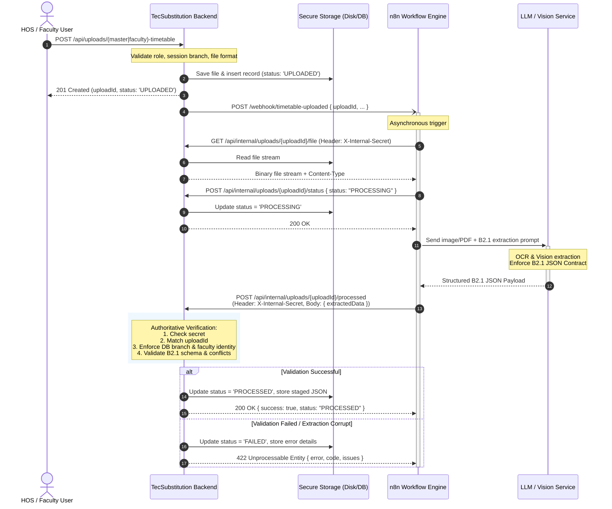

# Phase B2.2 — n8n Timetable Processing Workflow Specification

**Document Version:** 1.0.0  
**Phase:** B2.2 (Workflow Design & Internal API Contract Definition)  
**Target Repository:** TecSubstitution (`Sem_Project`)  
**Status:** Completed & Validated  

---

## Executive Summary

Phase B2.2 designs the integration bridge between the existing Phase B1 file upload system and the downstream n8n automation engine. This workflow handles asynchronous document extraction via an LLM/Vision model and returns strict, deterministic JSON adhering to the approved [Phase B2.1 JSON Contract](file:///e:/Project/SEM_project/Sem_Project/docs/PHASE_B2_1_JSON_CONTRACT.md).

This phase defines the architectural blueprint, security models, upload ownership rules, status state machine, and internal API contracts. In accordance with project instructions, no LLM calls, OCR code, database insertions, or timetable activations are implemented in this phase.

---

## 1. Existing B1 Upload Architecture

Inspection of `src/routes/uploads.js`, `src/data/uploads.js`, and `src/db/schema.sql` establishes the existing Phase B1 foundation:

### 1.1 Upload Endpoints & Scopes
- **Master Timetable (`POST /api/uploads/master-timetable`):**
  - Restricted to `hos` and `coordinator` roles.
  - Automatically inherits the branch from the authenticated session (`req.session.department`).
  - Client attempts to supply or alter the branch are strictly rejected (`403 FORBIDDEN`).
  - Creates an upload record with `upload_type = 'MASTER_TIMETABLE'` and `faculty_id = NULL`.
- **Faculty Timetable (`POST /api/uploads/faculty-timetable`):**
  - Restricted to the `faculty` role.
  - Automatically inherits both the faculty identity (`sessionFaculty = req.session.facultyName`) and the branch (`sessionDept = req.session.department`).
  - Client attempts to upload on behalf of another faculty member or branch are rejected (`403 FORBIDDEN`).
  - Creates an upload record with `upload_type = 'FACULTY_TIMETABLE'` and `faculty_id = sessionFaculty`.

### 1.2 Storage Architecture
- **Disk Storage:** Uploaded files (PDF, PNG, JPG, JPEG) are saved in non-public local storage:
  `uploads/timetables/${uploadId}${ext}`.
- **Access Control:** Direct web access via `/uploads/*` is explicitly blocked by `server.js` (`404 NOT_FOUND`). Files cannot be read without backend authorization.
- **Metadata Persistence:** Upload records are stored in PostgreSQL (`timetable_uploads` table) with an in-memory array fallback (`src/data/uploads.js`).
- **Initial Status:** All new uploads enter the state `'UPLOADED'`.

### 1.3 Identification & Metadata Schema
```sql
-- Schema from src/db/schema.sql
CREATE TABLE timetable_uploads (
    id                 SERIAL PRIMARY KEY,
    upload_id          TEXT NOT NULL UNIQUE,     -- e.g. 'upl_m7a8bcd_1a2b3c4d5e6f'
    original_filename  TEXT NOT NULL,
    file_type          TEXT NOT NULL,            -- e.g. 'application/pdf', 'image/png'
    file_size          INTEGER NOT NULL,
    storage_path       TEXT NOT NULL,            -- Absolute disk path
    uploader_user_id   INTEGER REFERENCES users(id) ON DELETE SET NULL,
    faculty_id         INTEGER REFERENCES faculty(id) ON DELETE SET NULL,
    branch_id          INTEGER REFERENCES departments(id) ON DELETE CASCADE,
    department_code    TEXT NOT NULL,            -- Authoritative uppercase branch code
    upload_type        TEXT NOT NULL CHECK (upload_type IN ('MASTER_TIMETABLE', 'FACULTY_TIMETABLE')),
    status             TEXT NOT NULL DEFAULT 'UPLOADED'
                       CHECK (status IN ('UPLOADED', 'PROCESSING', 'PROCESSED', 'FAILED')),
    created_at         TIMESTAMPTZ NOT NULL DEFAULT now()
);
```

---

## 2. Proposed n8n Workflow Architecture

The proposed integration implements a secure, decoupled processing pipeline:

```
[ User Browser ]
       │  1. Upload Document (Master or Faculty)
       ▼
[ TecSubstitution Core API ]
       │  2. Store file securely (uploads/timetables) + save metadata ('UPLOADED')
       │  3. Fire Webhook / Trigger Dispatch (Async)
       ▼
[ n8n Automation Engine ]
       │  4. Authenticate & Download binary file via Internal API
       │  5. Transition status to 'PROCESSING'
       │  6. Forward binary + prompt to LLM / Vision Provider
       ▼
[ LLM / Vision Service (Gemini / Claude Vision / OpenAI) ]
       │  7. Extract structured timetable data
       │  8. Output strict JSON matching B2.1 Contract
       ▼
[ n8n Automation Engine ]
       │  9. POST JSON + uploadId back to Internal API
       ▼
[ TecSubstitution Core Backend ]
       │ 10. Verify Internal API secret
       │ 11. Validate authoritative uploadId, branch & faculty ownership
       │ 12. Validate extracted JSON against B2.1 schema & reference catalog
       │ 13. Update status to 'PROCESSED' (or 'FAILED' on validation error)
       ▼
[ Staging / Review / Database Activation (Phase B2.3 / B2.4) ]
```

---

## 3. Step-by-Step Workflow Sequence Diagram



---

## 4. n8n → Backend Communication

n8n interacts with the TecSubstitution backend through four dedicated internal endpoints. These endpoints reside behind an internal service authentication layer:

1. **`GET /api/internal/uploads/:uploadId`**  
   Retrieves complete internal metadata for an upload (including `departmentCode`, `uploadType`, `facultyId`, `originalFilename`, `fileSize`, `status`).
2. **`GET /api/internal/uploads/:uploadId/file`**  
   Securely streams the raw uploaded file (`application/pdf`, `image/png`, etc.) directly from disk to n8n.
3. **`POST /api/internal/uploads/:uploadId/status`**  
   Allows n8n to transition upload status (e.g. from `UPLOADED` to `PROCESSING`).
4. **`POST /api/internal/uploads/:uploadId/processed`**  
   Receives the final extracted JSON data from n8n, executes backend validations, and updates the upload record status to `PROCESSED`.
5. **`POST /api/internal/uploads/:uploadId/fail`**  
   Receives extraction failure reports from n8n (e.g., OCR timeout, unreadable image), recording the failure reason and updating the status to `FAILED`.

---

## 5. Backend → n8n Communication

When a user completes an upload via `POST /api/uploads/master-timetable` or `POST /api/uploads/faculty-timetable`:
1. If the environment variable `N8N_WEBHOOK_URL` is configured, TecSubstitution dispatches an asynchronous HTTP POST request to the webhook:
   ```json
   {
     "event": "TIMETABLE_UPLOADED",
     "uploadId": "upl_m7a8bcd_1a2b3c4d5e6f",
     "uploadType": "MASTER_TIMETABLE",
     "departmentCode": "CME",
     "facultyId": null,
     "originalFilename": "CME_V_SEM_MASTER.pdf",
     "fileType": "application/pdf",
     "fileSize": 245102,
     "timestamp": "2026-09-06T11:30:00.000Z"
   }
   ```
2. The dispatch is **fire-and-forget** (non-blocking) with a short connection timeout (e.g., 5 seconds) so that an unreachable n8n server never hangs or degrades user upload response times.
3. If n8n is offline or unconfigured, the file remains safely stored on disk with status `UPLOADED`, ready for subsequent manual or scheduled retry.

---

## 6. Exact API Contract (Internal API)

### Common Request Headers
Every internal endpoint requires:
```http
X-Internal-Secret: <INTERNAL_API_SECRET>
Content-Type: application/json
```

---

### 6.1 `GET /api/internal/uploads/:uploadId`
Fetches complete metadata for a given upload.

- **URL Parameters:** `uploadId` (String, required)
- **Response (200 OK):**
  ```json
  {
    "uploadId": "upl_m7a8bcd_1a2b3c4d5e6f",
    "originalFilename": "CME_V_SEM_MASTER.pdf",
    "fileType": "application/pdf",
    "fileSize": 245102,
    "uploadType": "MASTER_TIMETABLE",
    "departmentCode": "CME",
    "facultyId": null,
    "status": "UPLOADED",
    "createdAt": "2026-09-06T11:30:00.000Z"
  }
  ```

---

### 6.2 `GET /api/internal/uploads/:uploadId/file`
Streams the binary file from local storage to n8n.

- **URL Parameters:** `uploadId` (String, required)
- **Response (200 OK):** Binary stream with appropriate headers:
  ```http
  Content-Type: application/pdf (or image/png, image/jpeg)
  Content-Length: 245102
  Content-Disposition: attachment; filename="CME_V_SEM_MASTER.pdf"
  ```

---

### 6.3 `POST /api/internal/uploads/:uploadId/status`
Updates upload status to prevent concurrent processing.

- **URL Parameters:** `uploadId` (String, required)
- **Request Body:**
  ```json
  {
    "status": "PROCESSING"
  }
  ```
- **Response (200 OK):**
  ```json
  {
    "success": true,
    "uploadId": "upl_m7a8bcd_1a2b3c4d5e6f",
    "status": "PROCESSING",
    "updatedAt": "2026-09-06T11:30:05.000Z"
  }
  ```

---

### 6.4 `POST /api/internal/uploads/:uploadId/processed`
Delivers the LLM-extracted timetable JSON back to TecSubstitution.

- **URL Parameters:** `uploadId` (String, required)
- **Request Body:**
  ```json
  {
    "uploadId": "upl_m7a8bcd_1a2b3c4d5e6f",
    "extractedData": {
      "contract_version": "2.1",
      "timetable_type": "MASTER_TIMETABLE",
      "institution_name": "ADITYA INSTITUTE OF TECHNOLOGY AND MANAGEMENT",
      "title": "POLYTECHNIC C23 - V SEM TIME TABLE",
      "department_code": "CME",
      "academic_year": "2026-27",
      "semester": 5,
      "class_name": "CME-A",
      "faculty_name": null,
      "faculty_code": null,
      "default_room": "C-401",
      "days": ["Monday", "Tuesday", "Wednesday", "Thursday", "Friday", "Saturday"],
      "periods": [1, 2, 3, 4, 5, 6, 7],
      "period_timings": {
        "1": { "start": "08:00", "end": "08:45" },
        "2": { "start": "08:45", "end": "09:30" }
      },
      "entries": [
        {
          "day": "Monday",
          "period": 1,
          "span_to": 2,
          "subject_name": "Python Programming",
          "subject_code": "CM-505",
          "faculty_name": "Ms. B. Kusuma",
          "class_name": "CME-A",
          "room_code": "C-401",
          "session_type": "theory",
          "is_free": false,
          "raw_cell_text": "PP - Ms. B. Kusuma (C-401)"
        }
      ],
      "extraction_metadata": {
        "confidence_score": 0.98,
        "warnings": []
      }
    }
  }
  ```
- **Response (200 OK):**
  ```json
  {
    "success": true,
    "uploadId": "upl_m7a8bcd_1a2b3c4d5e6f",
    "status": "PROCESSED",
    "department": "CME",
    "uploadType": "MASTER_TIMETABLE",
    "entryCount": 1,
    "warnings": [],
    "message": "Extracted timetable validated and staged successfully."
  }
  ```

---

### 6.5 `POST /api/internal/uploads/:uploadId/fail`
Notifies the backend of unrecoverable extraction or OCR errors.

- **Request Body:**
  ```json
  {
    "uploadId": "upl_m7a8bcd_1a2b3c4d5e6f",
    "errorCode": "LLM_EXTRACTION_FAILED",
    "errorMessage": "Document image resolution too low for table text recognition.",
    "details": {
      "attemptCount": 2,
      "visionModel": "gemini-1.5-flash"
    }
  }
  ```
- **Response (200 OK):**
  ```json
  {
    "success": true,
    "uploadId": "upl_m7a8bcd_1a2b3c4d5e6f",
    "status": "FAILED",
    "message": "Upload marked as FAILED."
  }
  ```

---

## 7. Authentication & Security Mechanism

1. **Shared Secret Authentication:**  
   Internal APIs are guarded by `INTERNAL_API_SECRET` defined in `.env`. Calls lacking `X-Internal-Secret: <SECRET>` are rejected immediately with `401 UNAUTHORIZED`.
2. **Session Decoupling:**  
   The internal API does not rely on user session cookies (`connect.sid`). This allows n8n (an autonomous server process) to interact reliably without needing to maintain or spoof a browser user session.
3. **No Direct Public File Access:**  
   The binary file can only be fetched through `GET /api/internal/uploads/:uploadId/file` with the internal secret. Public users calling `/uploads/*` receive `404 NOT_FOUND`.
4. **Network / IP Restricting (Optional):**  
   In production, internal endpoints can be restricted to `127.0.0.1` or the private Docker bridge network hosting n8n.

---

## 8. Upload ID Ownership Model

The `upload_id` is the **authoritative foreign key** governing the entire processing lifecycle:
- It is generated by the server via `crypto.randomBytes(6)` and permanently linked to the file on disk and row in `timetable_uploads`.
- It cannot be forged or guessed.
- When n8n delivers processed data, the backend queries `timetable_uploads` by `upload_id` to retrieve the authentic context:
  - Authoritative branch (`department_code`).
  - Authoritative upload type (`upload_type`).
  - Authoritative faculty owner (`faculty_id`).
  - Authorized uploader user (`uploader_user_id`).

---

## 9. Branch Isolation Rules

The system enforces strict single-branch integrity:

1. **Authoritative Context:**  
   The `department_code` stored in `timetable_uploads` at the moment of upload is **immutable and authoritative**.
2. **LLM Hallucination Guard:**  
   If the LLM vision step reads the header as `EEE` or `CIV` when the backend upload record is `CME`, the backend **must not** reassign the upload to `EEE`.
3. **Rejection or Correction:**  
   The backend checks:
   ```javascript
   if (extractedData.department_code.toUpperCase() !== uploadRecord.departmentCode.toUpperCase()) {
       // Log discrepancy warning and enforce uploadRecord.departmentCode
       extractedData.department_code = uploadRecord.departmentCode;
   }
   ```
   If there is a fundamental mismatch where the document clearly belongs to another department, the backend rejects the callback with `422 UNPROCESSABLE_ENTITY` (`BRANCH_MISMATCH`).

---

## 10. Faculty Ownership Rules

For `FACULTY_TIMETABLE` uploads:
1. The upload record's `faculty_id` (e.g. `"Ms. B. Kusuma"`) is authoritative.
2. The LLM cannot reassign the extracted schedule to any other faculty member.
3. If `extractedData.faculty_name` differs from the upload record's `faculty_id`, the backend flags a validation error or re-maps it to the authenticated faculty member.
4. For `MASTER_TIMETABLE` uploads, `faculty_id` in the upload record is `null`. The LLM extracts faculty names per cell, and the backend verifies each against the department faculty roster (`src/db/repository.js: resolveRefs`).

---

## 11. Status Transition Design

### 11.1 Allowed State Machine
```
   [ UPLOADED ]
         │
         ▼
  [ PROCESSING ]
     │        │
     │        ▼
     │   [ FAILED ]
     ▼
[ PROCESSED ]
```

### 11.2 Valid State Transitions
| Current Status | Next Status | Trigger | Authorized Actor |
| :--- | :--- | :--- | :--- |
| `UPLOADED` | `PROCESSING` | n8n starts extraction job | Internal API (`/status`) |
| `PROCESSING` | `PROCESSED` | Successful validation of extracted JSON | Internal API (`/processed`) |
| `PROCESSING` | `FAILED` | Extraction failed, timeout, or validation error | Internal API (`/fail` or `/processed`) |
| `UPLOADED` | `FAILED` | Immediate failure (corrupt file, zero bytes) | Backend Core |
| `FAILED` | `PROCESSING` | User or HOS triggers re-try | HOS / Faculty UI Action |

### 11.3 Scope Separation
- **Phase B2.2 (Current):** Documents status transitions and validation rules.
- **Phase B2.3:** Implements the internal API endpoints and DB status updates.
- **Phase B2.4:** Implements active database insertion into the live `timetable` table.

---

## 12. Error and Failure Handling

| Failure Condition | HTTP Status | Response Code | System Action |
| :--- | :--- | :--- | :--- |
| Missing or invalid `X-Internal-Secret` | `401` | `UNAUTHORIZED` | Request rejected; no status change. |
| `uploadId` not found in database | `404` | `NOT_FOUND` | Request rejected. |
| Upload file missing from disk | `500` | `FILE_NOT_FOUND` | Status transitioned to `FAILED`. |
| Upload already `PROCESSED` | `409` | `ALREADY_PROCESSED` | Idempotent response returned; data untouched. |
| Extracted JSON fails B2.1 schema validation | `422` | `SCHEMA_VALIDATION_FAILED` | Status transitioned to `FAILED`; issues returned. |
| Extracted timetable contains double-booking | `422` | `SLOT_CONFLICT` | Status transitioned to `FAILED`; clashes listed. |
| Extracted subject/class not in catalog | `422` | `UNKNOWN_REFERENCE` | Status transitioned to `FAILED`; missing refs returned. |
| LLM Vision model timeout / network failure | N/A | `EXTRACTION_TIMEOUT` | n8n calls `/fail`; status transitioned to `FAILED`. |

---

## 13. Idempotency Strategy

To guard against network retries or duplicate webhook firings:
1. **Status Lock Check:**  
   When `POST /api/internal/uploads/:uploadId/processed` is called:
   - If current status is `PROCESSED`: The backend returns HTTP `200 OK` (or `409 CONFLICT` with existing results) without re-validating or writing duplicate records.
   - If current status is `PROCESSING`: The backend proceeds with atomic validation.
2. **Atomic DB Transactions:**  
   Validation and status updates are wrapped in `db.withTransaction()`, guaranteeing that metadata updates and staged results commit atomically.

---

## 14. LLM Input / Output Boundary

### 14.1 What the LLM Receives
- **Input Content:** Binary PDF or Image (JPEG/PNG) of the timetable document.
- **Context Injection:**
  - `timetable_type`: `"MASTER_TIMETABLE"` or `"FACULTY_TIMETABLE"`.
  - `department_code`: Target branch (e.g. `"CME"`).
  - `expected_days`: `["Monday", "Tuesday", "Wednesday", "Thursday", "Friday", "Saturday"]`.
  - `expected_periods`: `[1, 2, 3, 4, 5, 6, 7]`.
- **System Instructions:** Strictly enforce negative constraints (never guess unprinted faculty, subject codes, rooms, or period times).

### 14.2 What the LLM Returns
- **Output Content:** A single, valid JSON object strictly matching `docs/PHASE_B2_1_JSON_CONTRACT.md`.
- No markdown wrappers (` ```json `), conversational commentary, or trailing text.

---

## 15. Reference to B2.1 JSON Contract

The payload sent in `extractedData` must strictly comply with the schema defined in [docs/PHASE_B2_1_JSON_CONTRACT.md](file:///e:/Project/SEM_project/Sem_Project/docs/PHASE_B2_1_JSON_CONTRACT.md), including:
- Root fields: `contract_version`, `timetable_type`, `department_code`, `days`, `periods`, `entries`.
- Entry fields: `day`, `period`, `span_to`, `subject_name`, `subject_code`, `faculty_name`, `class_name`, `room_code`, `session_type`, `is_free`, `raw_cell_text`.
- Metadata: `extraction_metadata.confidence_score`, `extraction_metadata.warnings`.

---

## 16. Example Request (`n8n → Backend`)

```http
POST /api/internal/uploads/upl_m7a8bcd_1a2b3c4d5e6f/processed HTTP/1.1
Host: localhost:3001
X-Internal-Secret: 7f8a9b0c1d2e3f4a5b6c7d8e9f0a1b2c
Content-Type: application/json

{
  "uploadId": "upl_m7a8bcd_1a2b3c4d5e6f",
  "extractedData": {
    "contract_version": "2.1",
    "timetable_type": "MASTER_TIMETABLE",
    "institution_name": "ADITYA INSTITUTE OF TECHNOLOGY AND MANAGEMENT",
    "title": "POLYTECHNIC C23 - V SEM TIME TABLE",
    "department_code": "CME",
    "academic_year": "2026-27",
    "semester": 5,
    "class_name": "CME-A",
    "faculty_name": null,
    "faculty_code": null,
    "default_room": "C-401",
    "days": ["Monday", "Tuesday", "Wednesday", "Thursday", "Friday", "Saturday"],
    "periods": [1, 2, 3, 4, 5, 6, 7],
    "period_timings": {
      "1": { "start": "08:00", "end": "08:45" },
      "2": { "start": "08:45", "end": "09:30" },
      "3": { "start": "09:30", "end": "10:15" },
      "4": { "start": "10:30", "end": "11:15" },
      "5": { "start": "11:15", "end": "12:00" },
      "6": { "start": "12:00", "end": "12:45" },
      "7": { "start": "12:45", "end": "13:30" }
    },
    "entries": [
      {
        "day": "Monday",
        "period": 1,
        "span_to": 2,
        "subject_name": "Python Programming",
        "subject_code": "CM-505",
        "faculty_name": "Ms. B. Kusuma",
        "class_name": "CME-A",
        "room_code": "C-401",
        "session_type": "theory",
        "is_free": false,
        "raw_cell_text": "PP - Ms. B. Kusuma (C-401)"
      },
      {
        "day": "Monday",
        "period": 3,
        "span_to": null,
        "subject_name": "Industrial Management and Entrepreneurship",
        "subject_code": "CM-501",
        "faculty_name": "Sri B. Gopala Rao",
        "class_name": "CME-A",
        "room_code": "C-401",
        "session_type": "theory",
        "is_free": false,
        "raw_cell_text": "IME - Sri B. Gopala Rao"
      }
    ],
    "extraction_metadata": {
      "confidence_score": 0.98,
      "warnings": []
    }
  }
}
```

---

## 17. Example Successful Response (`Backend → n8n`)

```http
HTTP/1.1 200 OK
Content-Type: application/json

{
  "success": true,
  "uploadId": "upl_m7a8bcd_1a2b3c4d5e6f",
  "status": "PROCESSED",
  "department": "CME",
  "uploadType": "MASTER_TIMETABLE",
  "entryCount": 2,
  "warnings": [],
  "message": "Extracted timetable validated and staged successfully."
}
```

---

## 18. Example Error Responses

### 18.1 Unauthorized Secret
```http
HTTP/1.1 401 Unauthorized
Content-Type: application/json

{
  "error": "Invalid or missing internal service secret.",
  "code": "UNAUTHORIZED"
}
```

### 18.2 Schema or Unknown Reference Validation Error
```http
HTTP/1.1 422 Unprocessable Entity
Content-Type: application/json

{
  "error": "Timetable validation failed: Unknown subject \"Quantum Computing\", class \"CME-C\".",
  "code": "VALIDATION_FAILED",
  "details": {
    "missingReferences": ["subject \"Quantum Computing\"", "class \"CME-C\""],
    "conflicts": []
  }
}
```

### 18.3 Conflict (Already Processed)
```http
HTTP/1.1 409 Conflict
Content-Type: application/json

{
  "error": "Upload upl_m7a8bcd_1a2b3c4d5e6f is already processed.",
  "code": "ALREADY_PROCESSED",
  "status": "PROCESSED"
}
```

---

## 19. What Belongs to Phase B2.2 (Current Phase)

- Inspection of existing upload models, storage layout, and security guards.
- Comprehensive workflow architecture specification.
- Internal API contract design (`/api/internal/uploads/*`).
- Security model, shared secret authentication, and network isolation definitions.
- Authoritative upload ID ownership rules.
- State transition definitions (`UPLOADED` -> `PROCESSING` -> `PROCESSED`/`FAILED`).
- Detailed documentation in `docs/PHASE_B2_2_N8N_WORKFLOW.md`.

---

## 20. What Must Wait for Phase B2.3 / B2.4

- **Phase B2.3 (Backend Staging & Internal Routes Implementation):**
  - Mounting internal router `/api/internal/uploads` protected by `INTERNAL_API_SECRET`.
  - Creating file streaming route (`GET /api/internal/uploads/:uploadId/file`).
  - Implementing backend B2.1 schema validation middleware.
  - Adding optional webhook dispatcher in `src/routes/uploads.js` triggered after upload.
  - Test suites for internal API endpoints.
- **Phase B2.4 (n8n & LLM Extraction Integration):**
  - Creating the n8n workflow configuration JSON.
  - Integrating LLM Vision prompts (Gemini Vision / Claude Vision).
  - Full end-to-end integration test (upload PDF -> n8n -> Vision -> backend staging).
- **Subsequent Phases:**
  - Committing staged timetable entries into the live `timetable` table.
  - UI staging review screens for HOS and Faculty before timetable activation.
