# 02 — Entity-Relationship (ER) Diagram

This document provides the Entity-Relationship (ER) diagram for the **TecSubstitution** database, derived strictly from the active PostgreSQL relational schema defined in [src/db/schema.sql](file:///e:/Project/SEM_project/Sem_Project/src/db/schema.sql).

---

## 1. Relational ER Diagram (Mermaid)

```mermaid
erDiagram
    DEPARTMENTS ||--o{ FACULTY : "employs"
    DEPARTMENTS ||--o{ SUBJECTS : "curates"
    DEPARTMENTS ||--o{ CLASSES : "manages"
    DEPARTMENTS ||--o{ USERS : "scopes"
    DEPARTMENTS ||--o{ TIMETABLE_UPLOADS : "owns"

    ROOMS ||--o{ CLASSES : "home_room"
    ROOMS ||--o{ TIMETABLE : "assigned_venue"

    FACULTY ||--o{ FACULTY_SUBJECTS : "specializes_in"
    FACULTY ||--o{ USERS : "identifies"
    FACULTY ||--o{ TIMETABLE : "teaches"
    FACULTY ||--o{ FACULTY_ATTENDANCE : "logged_for"
    FACULTY ||--o{ EXAM_INVIGILATION : "assigned_to"
    FACULTY ||--o{ EXAM_INVIGILATION_REQUESTS : "submits"
    FACULTY ||--o{ FACULTY_SUBSTITUTIONS : "original_instructor"
    FACULTY ||--o{ FACULTY_SUBSTITUTIONS : "substitute_instructor"

    SUBJECTS ||--o{ TIMETABLE : "instructed_in"
    CLASSES ||--o{ TIMETABLE : "scheduled_for"

    USERS ||--o{ TIMETABLE_UPLOADS : "uploads"
    USERS ||--o{ TIMETABLE_STAGING : "reviews"

    TIMETABLE_UPLOADS ||--|| TIMETABLE_STAGING : "stages_content"
    EXAM_INVIGILATION_REQUESTS ||--o{ EXAM_INVIGILATION : "activates"

    DEPARTMENTS {
        int id PK
        text code UK "Unique branch code e.g. CME, EEE"
        text name "Full branch name"
        text academic_year "e.g. 2025-2026"
        int semester "Active semester"
        int total_semesters "Default 6"
        boolean active "Soft delete / active flag"
    }

    ROOMS {
        int id PK
        text code UK "Room identifier e.g. C-401"
        text name "Room description"
        text room_type "CHECK: classroom, lab"
        int capacity "Seating capacity"
    }

    FACULTY {
        int id PK
        text code UK "Unique faculty identifier"
        text name UK "Faculty full name"
        int department_id FK "References departments(id)"
        text email UK "Unique email address"
        text designation "Assistant Professor, HOS, etc."
        text phone "Contact phone number"
        int max_weekly_periods "Workload cap"
        text status "CHECK: active, on_leave, inactive"
    }

    FACULTY_SUBJECTS {
        int id PK
        int faculty_id FK "References faculty(id)"
        text subject "Subject competency"
    }

    SUBJECTS {
        int id PK
        text code UK "Course code e.g. CS-401"
        text name "Course title"
        int department_id FK "References departments(id)"
        text subject_type "CHECK: theory, lab, activity"
    }

    CLASSES {
        int id PK
        text code UK "Section code e.g. CME-A"
        int department_id FK "References departments(id)"
        int semester "Semester level (1 to 6)"
        int home_room_id FK "References rooms(id)"
        text academic_year "e.g. 2025-2026"
        text section "Section letter e.g. A, B"
    }

    PERIODS {
        int period PK "Period index (1 to 7)"
        text start_time "Clock start e.g. 09:30 AM"
        text end_time "Clock end e.g. 10:20 AM"
    }

    USERS {
        int id PK
        text username UK "Account username"
        text password_hash "Encrypted password hash"
        text name "User display name"
        text role "CHECK: coordinator, hos, faculty"
        int department_id FK "References departments(id)"
        int faculty_id FK "References faculty(id)"
        boolean active "Account enabled flag"
        timestamptz created_at "Registration date"
    }

    TIMETABLE {
        int id PK
        int class_id FK "References classes(id)"
        text day_of_week "Monday through Saturday"
        int period "Period index (1 to 7)"
        int subject_id FK "References subjects(id)"
        int faculty_id FK "References faculty(id) (Nullable for activities)"
        int room_id FK "References rooms(id)"
        text session_type "CHECK: theory, lab, activity"
        timestamptz created_at "Creation timestamp"
    }

    TIMETABLE_UPLOADS {
        int id PK
        text upload_id UK "UUID / alphanumeric string"
        text original_filename "Uploaded file name"
        text file_type "MIME type (image/jpeg, application/pdf)"
        int file_size "File size in bytes"
        text storage_path "Disk storage destination"
        int uploader_user_id FK "References users(id)"
        int branch_id FK "References departments(id)"
        text department_code "Branch code"
        text upload_type "CHECK: MASTER_TIMETABLE, FACULTY_TIMETABLE"
        text status "CHECK: UPLOADED, PROCESSING, PROCESSED, FAILED"
        timestamptz created_at "Upload timestamp"
    }

    TIMETABLE_STAGING {
        int id PK
        text upload_id UK,FK "References timetable_uploads(upload_id)"
        jsonb extracted_json "Extracted B2.1 JSON payload"
        text validation_status "CHECK: PENDING, VALID, INVALID"
        jsonb validation_errors "JSON array of validation discrepancies"
        text import_status "CHECK: STAGED, APPROVED, REJECTED, IMPORTED"
        int reviewed_by FK "References users(id)"
        timestamptz reviewed_at "Review timestamp"
        text rejection_reason "Remarks if rejected"
        timestamptz imported_at "Live import timestamp"
        int imported_count "Number of live records created"
        jsonb unresolved_entities "Unmatched catalog entities"
        jsonb entity_mappings "HOS explicit mappings"
    }

    FACULTY_ATTENDANCE {
        int id PK
        int faculty_id FK "References faculty(id)"
        date attendance_date "Calendar date (YYYY-MM-DD)"
        text status "CHECK: PRESENT, ABSENT"
        text marked_by "HOS username who recorded"
        timestamptz created_at "Record creation timestamp"
        timestamptz updated_at "Update timestamp"
    }

    EXAM_INVIGILATION {
        int id PK
        int faculty_id FK "References faculty(id)"
        text branch_code "Department code"
        date exam_date "Examination date"
        int period "Period index (1 to 7)"
        text source "CHECK: DIRECT, REQUEST"
        int request_id FK "References exam_invigilation_requests(id)"
        text assigned_by "HOS username who assigned"
        text notes "Optional exam room notes"
    }

    EXAM_INVIGILATION_REQUESTS {
        int id PK
        int faculty_id FK "References faculty(id)"
        text branch_code "Department code"
        date exam_date "Requested date"
        int[] periods "Array of requested period numbers"
        text reason "Optional faculty reason"
        text status "CHECK: PENDING, APPROVED, REJECTED"
        text reviewed_by "HOS reviewer"
        text rejection_reason "Rejection remark"
    }

    FACULTY_SUBSTITUTIONS {
        text id PK "Alphanumeric substitution ID"
        date date "Substitution date"
        text day_of_week "Day name e.g. Friday"
        int period "Period index (1 to 7)"
        text class_name "Target class e.g. CME-A"
        text subject "Subject title"
        text room "Classroom identifier"
        int original_faculty_id FK "References faculty(id)"
        text original_faculty_name "Name of absent instructor"
        text original_faculty_branch "Branch of absent instructor"
        int substitute_faculty_id FK "References faculty(id)"
        text substitute_faculty_name "Name of covering instructor"
        text substitute_faculty_branch "Branch of covering instructor"
        text requested_by "Initiator username"
        text status "CHECK: PENDING, ACCEPTED, REJECTED, CANCELLED"
        text rejection_reason "Peer rejection note"
        timestamptz created_at "Request timestamp"
        timestamptz responded_at "Acceptance / Rejection timestamp"
    }

    FACULTY_REGISTRATION_REQUESTS {
        int id PK
        text full_name "Faculty full name"
        text phone "Contact phone"
        text username "Requested username"
        text password_hash "Hashed password"
        text designation "Academic title"
        text[] subjects "Array of subjects"
        text branch_code "Target department code"
        text status "CHECK: PENDING, APPROVED, REJECTED"
        text reviewed_by "HOS reviewer"
    }
```

---

## 2. Key Schema Integrity Constraints

1. **Unique Class Slot**:
   - `CONSTRAINT timetable_class_slot_unique UNIQUE (class_id, day_of_week, period)`
   - Ensures a single section cannot have two classes scheduled in the same period.

2. **Faculty Double-Booking Prevention**:
   - `CREATE UNIQUE INDEX timetable_faculty_slot_unique ON timetable (faculty_id, day_of_week, period) WHERE faculty_id IS NOT NULL;`
   - Disallows an instructor from being assigned to two classes simultaneously.

3. **Room Double-Booking Prevention**:
   - `CREATE UNIQUE INDEX timetable_room_slot_unique ON timetable (room_id, day_of_week, period) WHERE room_id IS NOT NULL;`
   - Guarantees room exclusivity per time slot.

4. **Attendance Uniqueness**:
   - `CONSTRAINT faculty_attendance_unique UNIQUE (faculty_id, attendance_date)`
   - Restricts attendance to exactly one status record per faculty member per date.

5. **Invigilation Uniqueness**:
   - `CONSTRAINT exam_invigilation_unique UNIQUE (faculty_id, exam_date, period)`
   - Prevents duplicate exam supervision duty assignments for a faculty member in the same period.
