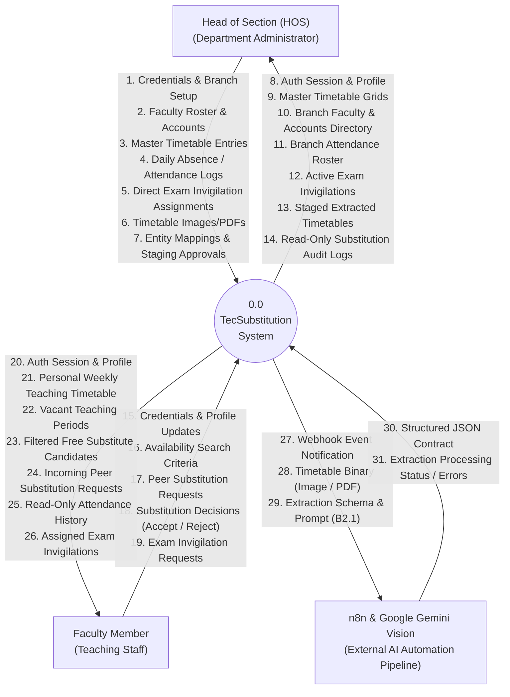

# 03 — Data Flow Diagram (DFD Level 0: Context Diagram)

This document presents the **DFD Level 0 (Context Diagram)** for the **TecSubstitution** system. The context diagram outlines the system boundaries, the external entities (actors and external automation pipelines), and the primary data flows entering and leaving the system.

---

## 1. Context Diagram (Mermaid)

---

## 2. Explanation of External Entity Interactions

### 1. Head of Section (HOS)
- **Inputs to System**:
  - Department configuration (branch code, academic year, semester counts).
  - Faculty account details (name, designation, email, initial password).
  - Class timetable slots (class, day, period, subject, assigned teacher, classroom).
  - Daily faculty absence markers (Present/Absent, leave reasons).
  - Direct examination invigilation schedules.
  - Timetable document uploads (JPEG, PNG, PDF).
  - Manual entity mappings and final staged timetable approval/rejection decisions.
- **Outputs from System**:
  - Visual master class timetable grids with conflict highlights.
  - Departmental faculty directory and account rosters.
  - Real-time daily attendance rosters.
  - Active exam invigilation coverage lists.
  - Extracted timetable preview matrices with resolution statuses.
  - Read-only historical logs of peer substitutions.

### 2. Faculty Member
- **Inputs to System**:
  - Sign-in credentials and permitted profile updates (phone number, subject competencies).
  - Target day, period, and calendar date for substitute availability searches.
  - Peer substitution requests dispatched to selected free colleagues.
  - Explicit acceptance or rejection of incoming substitution invitations.
  - Submission of voluntary exam invigilation requests.
- **Outputs from System**:
  - Personalized weekly timetable grid.
  - List of vacant instructional periods.
  - Ranked list of free peer instructors (local department prioritized).
  - Real-time notification cards of incoming substitution requests.
  - Personal historical attendance ledger.
  - Personal exam invigilation duty assignments.

### 3. n8n & Google Gemini Vision Automation Pipeline
- **Inputs from System**:
  - Asynchronous webhook dispatch carrying the newly generated `uploadId`.
  - Secure internal endpoint streaming the uploaded document binary along with the strict Phase B2.1 JSON contract prompt.
- **Outputs to System**:
  - Multimodal OCR output formatted strictly as a structured JSON object.
  - Pipeline status callbacks (`PROCESSING`, `PROCESSED`, or `FAILED`) authenticated via `X-Internal-Secret`.
