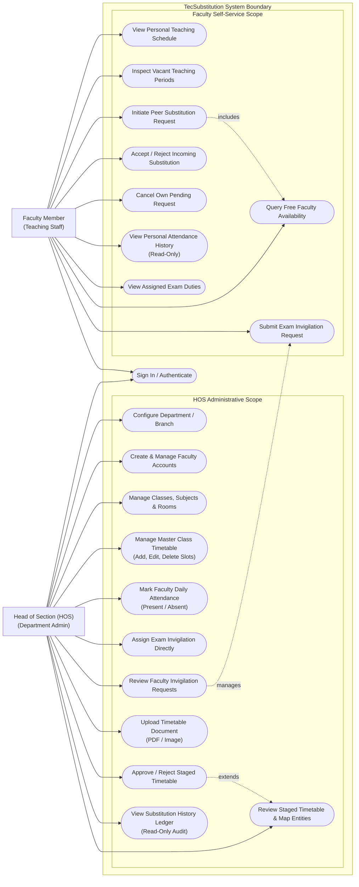

# 05 — Use-Case Diagram

This document illustrates the use cases implemented in the **TecSubstitution** system, defining the exact operational capabilities and boundaries of the two primary system actors: **Head of Section (HOS)** and **Faculty Member**.

---

## 1. Use-Case Diagram (Mermaid)

---

## 2. Actor Responsibilities & Strict Governance Boundaries

### Head of Section (HOS) Use Cases
1. **Sign In / Authenticate**: Obtains authenticated session tied strictly to their academic branch.
2. **Configure Department / Branch**: Updates department name, academic year, and active semesters.
3. **Create & Manage Faculty Accounts**: Provisions faculty accounts with enforced password complexity rules.
4. **Manage Catalog**: Curates branch sections (e.g. CME-A), classrooms, labs, and subject codes.
5. **Manage Master Class Timetable**: Adds, modifies, or vacates weekly class periods with conflict validation.
6. **Mark Faculty Daily Attendance**: Records teacher absence on calendar dates, feeding the availability engine.
7. **Assign Exam Invigilation Directly**: Schedules instructors to examination rooms for designated periods.
8. **Review Faculty Invigilation Requests**: Approves or denies volunteer invigilation duty submissions.
9. **Upload Timetable Document**: Ingests timetable scans or PDFs to trigger background AI extraction.
10. **Review Staged Timetable & Map Entities**: Inspects extracted JSON matrices and maps uncatalogued references.
11. **Approve / Reject Staged Timetable**: Executes atomic transactional live imports or rejects invalid uploads.
12. **View Substitution History Ledger**: Read-only monitoring of completed peer substitutions for departmental accountability.

> [!WARNING]
> **Strict Governance Rule**: The HOS **cannot** create, assign, or accept substitution requests on behalf of instructors. The substitution mechanism is strictly peer-to-peer.

### Faculty Member Use Cases
1. **Sign In / Authenticate**: Logs into their personal departmental account.
2. **View Personal Teaching Schedule**: Renders an individualized weekly timetable grid.
3. **Inspect Vacant Teaching Periods**: Identifies periods where no classroom instruction is scheduled.
4. **Query Free Faculty Availability**: Evaluates available colleagues across the campus for a specific slot.
5. **Initiate Peer Substitution Request**: Dispatches a class coverage invitation to an available colleague.
6. **Accept / Reject Incoming Substitution**: Formally accepts or declines substitution requests sent by peers. Acceptance executes real-time availability revalidation.
7. **Cancel Own Pending Request**: Revokes an unaccepted substitution invitation.
8. **View Personal Attendance History**: Audits personal presence/absence records maintained by the HOS.
9. **Submit Exam Invigilation Request**: Requests examination supervision slots.
10. **View Assigned Exam Duties**: Inspects approved or assigned invigilation responsibilities.
