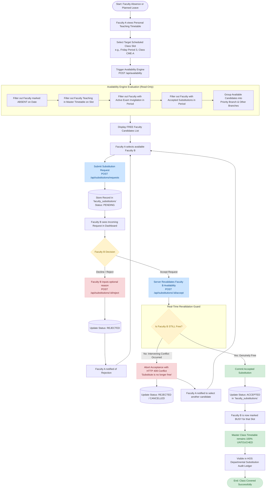

# 06 — Faculty-to-Faculty Substitution Workflow Diagram

This document illustrates the complete activity and decision workflow for peer-to-peer faculty substitutions (**Option A**), detailing how an absent instructor identifies vacant periods, queries available colleagues, and completes a substitution with real-time conflict revalidation.

---

## 1. Substitution Workflow Activity Diagram (Mermaid)

---

## 2. Key Workflow Characteristics

1. **Peer-to-Peer Initiation and Resolution**:
   - The entire request-and-acceptance lifecycle occurs strictly between the affected instructors (Faculty A and Faculty B).
   - The HOS does not act as an intermediary, avoiding administrative bottlenecks during early morning hours.

2. **Real-Time Revalidation at Acceptance**:
   - Because time may elapse between when Faculty A sends a request and when Faculty B accepts it, the system does not blindly trust the candidate's earlier availability status.
   - At the exact moment `POST /api/substitutions/:id/accept` is called, the server executes a fresh, atomic revalidation query across the master schedule, attendance, invigilations, and concurrent substitutions.

3. **Master Timetable Immutability**:
   - Accepted substitutions are stored as distinct records in the `faculty_substitutions` table.
   - The primary `timetable` table is **never mutated** during a substitution. This ensures that regular semester schedules, room allocations, and curriculum assignments remain intact for subsequent weeks.
