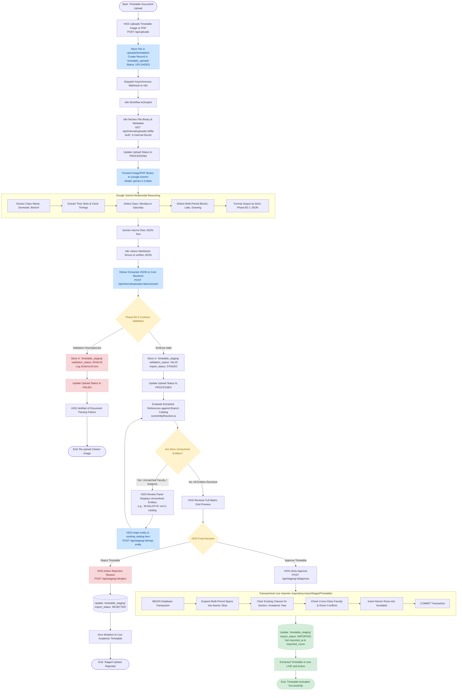

# 07 — AI-Assisted Timetable Ingestion & Approval Workflow

This document diagrams the complete lifecycle of AI-assisted timetable extraction, schema validation, entity resolution, and human-in-the-loop HOS approval.

---

## 1. AI Timetable Ingestion Workflow Diagram (Mermaid)

---

## 2. Key Safeguards of the AI Extraction Pipeline

1. **Strict Contract Validation (Phase B2.1 / B2.3)**:
   - The JSON returned by Google Gemini must pass rigid structural validation before being staged. Days must conform to institutional operational days, period numbers must be bounded (1 to 7), and session types must be classified (`theory`, `lab`, or `activity`).

2. **Decoupled Staging (`timetable_staging`)**:
   - The AI output is completely isolated in the staging database table. It has zero effect on regular faculty availability, class attendance, or student timetables while in the `STAGED` state.

3. **Zero Silent Creation Policy**:
   - Extracted faculty or subject names that do not match existing institutional records cannot be imported silently.
   - The HOS must explicitly map unrecognized strings (e.g. mapping an abbreviated teacher name to an existing faculty account) or register them beforehand.

4. **Atomic Transactional Commitment**:
   - When the HOS clicks **Approve**, the backend executes an atomic PostgreSQL transaction. If any cross-class teacher conflict or database error occurs during span expansion, the entire transaction rolls back cleanly, ensuring that partial or corrupt schedules can never exist in the live database.
